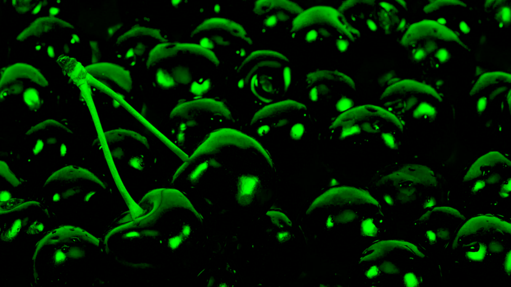
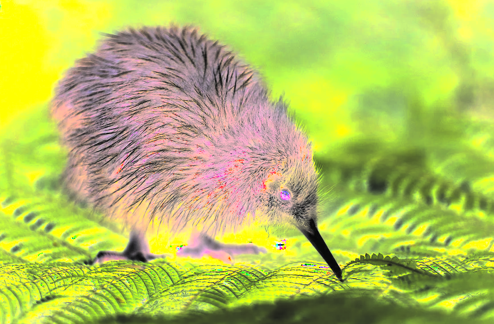

## Лабораторная работа №1. Цветовые модели и передискретизация изображений

1. Berry

- Сохранение отдельных каналов

|  |  |  |  |
|:-------------------------------:|:--------------------------------------------------:|:-----------------------------------------------------:|:---------------------------------------------------:|
|              original           |                    red_channel                      |                     green_channel                     |                     blue_channel                    |

- Яркостная компонента, инвертированная яркостная компонента и конвертация из RGB в HSI

|  |  |  |
|:--------------------------------------------:|:--------------------------------------------------------------:|:-----------------------------------------------:|
|                  intensity                   |                     inverted_intensity                         |                     rgb_to_hsi                  |

- Интерполяция в M раз, децимация в N раз, передискретизация изображения в K=M/N раз, передискретизация изображения в K раз за один проход

|  |  |  |  |  |
|:-------------------------------:|:-------------------------------------------------:|:-------------------------------------------------:|:-----------------------------------------------------------------------------:|:-----------------------------------------------------------------------------------------------------:|
|              original           |                  bilinear_resized_M=2              |                  mean_resized_N=3                  |                                 resized_M/N                                    |                                           resized_K=0.67                                              |


2. Buisness

- Сохранение отдельных каналов

|  |  |  |  |
|:-------------------------------------:|:----------------------------------------------------:|:-------------------------------------------------------:|:------------------------------------------------------:|
|                original               |                      red_channel                      |                       green_channel                      |                       blue_channel                      |

- Яркостная компонента, инвертированная яркостная компонента и конвертация из RGB в HSI

|  |  |  |
|:-----------------------------------------------:|:----------------------------------------------------------------:|:--------------------------------------------------:|
|                    intensity                    |                      inverted_intensity                          |                     rgb_to_hsi                     |

- Интерполяция в M раз, децимация в N раз, передискретизация изображения в K=M/N раз, передискретизация изображения в K раз за один проход

|  |  |  |  |  |
|:-------------------------------------:|:----------------------------------------------------:|:----------------------------------------------------:|:--------------------------------------------------------------------------------:|:----------------------------------------------------------------------------------------------------------:|
|                original               |                  bilinear_resized_M=2                 |                   mean_resized_N=3                   |                                  resized_M/N                                      |                                            resized_K=0.67                                                   |


3. Qiwi

- Сохранение отдельных каналов

|  |  |  |  |
|:-----------------------------:|:------------------------------------------------:|:---------------------------------------------------:|:--------------------------------------------------:|
|             original          |                   red_channel                     |                    green_channel                     |                    blue_channel                    |

- Яркостная компонента, инвертированная яркостная компонента и конвертация из RGB в HSI

|  |  |  |
|:-------------------------------------------:|:------------------------------------------------------------:|:----------------------------------------------:|
|                   intensity                 |                     inverted_intensity                       |                   rgb_to_hsi                   |

- Интерполяция в M раз, децимация в N раз, передискретизация изображения в K=M/N раз, передискретизация изображения в K раз за один проход

|  |  |  |  |  |
|:-----------------------------:|:------------------------------------------------:|:------------------------------------------------:|:----------------------------------------------------------------------------:|:------------------------------------------------------------------------------------------------------:|
|             original          |                bilinear_resized_M=2               |                 mean_resized_N=3                 |                                resized_M/N                                   |                                          resized_K=0.67                                                |

## Описание
Данная лабораторная работа посвящена обработке изображений с использованием различных цветовых моделей и методов передискретизации.

## Задания
### 1. Цветовые модели
1. Выделение компонентов R, G, B и сохранение как отдельные изображения.
2. Преобразование изображения к цветовой модели HSI, сохранение яркостной компоненты.
3. Инвертирование яркостной компоненты в исходном изображении.

### 2. Передискретизация
1. Интерполяция изображения в M раз.
2. Децимация изображения в N раз.
3. Передискретизация в K=M/N раз путём растяжения и последующего сжатия (в два прохода).
4. Передискретизация изображения в K раз за один проход.

## Использование
1. Запустите скрипт `python lab1/main.py` для обработки всех изображений или конкретного изображения.
2. Альтернативно, можно запустить скрипт с указанием конкретного изображения: `python lab1/main.py berry`
3. Результаты обработки будут сохранены в директории `lab1/new_img/` в отдельных папках для каждого изображения.

## Результаты обработки

После запуска скрипта для каждого изображения (`berry`, `buisness`, `qiwi`) будут созданы следующие файлы:

### Для каждого изображения (пример для berry)
- **Оригинальное изображение**: `lab1/new_img/berry/original.png`
- **RGB каналы**:
  - Красный канал: `lab1/new_img/berry/red_channel.png`
  - Зеленый канал: `lab1/new_img/berry/green_channel.png`
  - Синий канал: `lab1/new_img/berry/blue_channel.png`
- **HSI преобразование**:
  - HSI модель: `lab1/new_img/berry/rgb_to_hsi.png`
  - Яркостная компонента: `lab1/new_img/berry/intensity.png`
  - Инвертированная яркость: `lab1/new_img/berry/inverted_intensity.png`
- **Передискретизация**:
  - Растяжение (M=2): `lab1/new_img/berry/resized_M_2.png`
  - Сжатие (N=3): `lab1/new_img/berry/resized_N_3.png`
  - Двухпроходная передискретизация (M=2, N=3): `lab1/new_img/berry/two_pass_resampling_M2_N3.png`
  - Однопроходная передискретизация (K=0.67): `lab1/new_img/berry/one_pass_resampling_K0.6666666666666666.png`

## Начало работы
```
pip install -r lab1/requirements.txt
```
