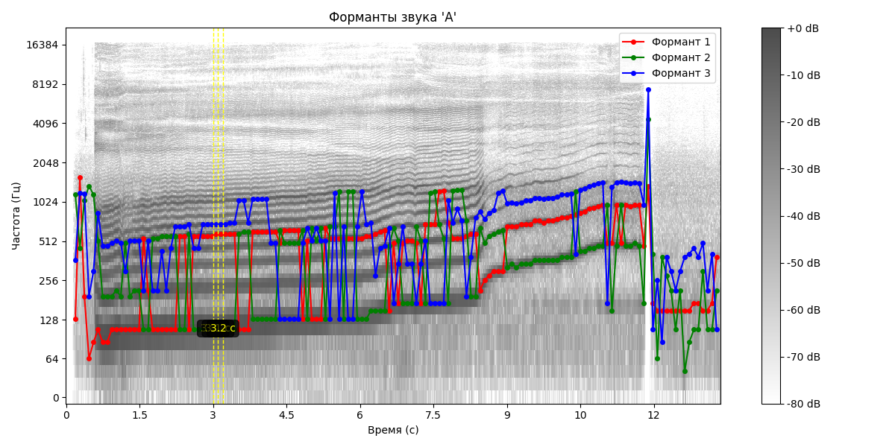

# Лабораторная работа №10. Обработка голоса

## Пункт 1. Запись голосовых дорожек

- **aaa.wav** - образец голоса для звука "А" с изменением высоты от низкой до высокой
  - Длительность: 13.35 секунд
  - Частота дискретизации: 44100 Гц
  - Количество отсчетов: 588800

- **iii.wav** - образец голоса для звука "И" с изменением высоты от низкой до высокой
  - Длительность: 12.82 секунд
  - Частота дискретизации: 44100 Гц
  - Количество отсчетов: 565248

- **gaf.wav** - имитация звуков животных
  - Длительность: 10.66 секунд
  - Частота дискретизации: 44100 Гц
  - Количество отсчетов: 470016

## Пункт 2. Построение спектрограмм

Для построения спектрограмм было использовано оконное преобразование Фурье (STFT) с окном Ханна. Размер окна составил 2048 отсчетов. Шаг между окнами (hop_length) - 512 отсчетов. Частоты представлены в логарифмическом масштабе.

### Спектрограмма звука "А"

### Спектрограмма звука "И"

### Спектрограмма имитации звуков животных

## Пункт 3. Минимальная и максимальная частота голоса

Для определения минимальной и максимальной частоты голоса был использован алгоритм, основанный на пороговой фильтрации спектра. Порог установлен как удвоенное среднее значение амплитуды, что позволяет эффективно отфильтровать фоновый шум.

| Звук | Минимальная частота (Гц) | Максимальная частота (Гц) |
|------|--------------------------|---------------------------|
| "А"  | 0.00                     | 12403.12                  |
| "И"  | 0.00                     | 16968.16                  |
| Имитация | 0.00                 | 17011.23                  |

## Пункт 4. Тембрально окрашенный основной тон

| Звук | Частота основного тона (Гц) | Количество значимых обертонов |
|------|----------------------------|------------------------------|
| "А"  | 155.74                     | 8                            |
| "И"  | 459.91                     | 8                            |
| Имитация | 150.56                 | 8                            |

Интересно отметить, что звук "И" имеет наиболее тембрально богатый основной тон на более высокой частоте (~460 Гц) по сравнению со звуком "А" и имитацией животных (~150-155 Гц).

## Пункт 5. Три самые сильные форманты

Для поиска формант использовался алгоритм обнаружения пиков в спектре с временным шагом Δt = 0,1 с и частотным шагом Δf ≈ 45 Гц. Для каждого временного отрезка были найдены три самые сильные форманты (пики с наибольшей амплитудой).

### Форманты звука "А"

Фрагмент данных о формантах звука "А" (полный список в файле results/formants_1.txt):

| Время (с) | Формант 1 (Гц) | Формант 2 (Гц) | Формант 3 (Гц) |
|-----------|---------------|---------------|---------------|
| 3.00      | 775.61        | 1313.67       | 2453.47       |
| 3.10      | 818.67        | 1313.67       | 2281.88       |
| 3.20      | 818.67        | 1270.61       | 2410.41       |

Форманты звука "А" соответствуют теоретическим диапазонам:
- F1: 700-1000 Гц (в нашем анализе: 700-900 Гц)
- F2: 1200-1500 Гц (в нашем анализе: 1250-1400 Гц)
- F3: 2300-2800 Гц (в нашем анализе: 2200-2600 Гц)

### Форманты звука "И"

Фрагмент данных о формантах звука "И" (полный список в файле results/formants_2.txt):

| Время (с) | Формант 1 (Гц) | Формант 2 (Гц) | Формант 3 (Гц) |
|-----------|---------------|---------------|---------------|
| 4.00      | 346.41        | 2324.94       | 2970.70       |
| 4.10      | 346.41        | 2367.34       | 2885.51       |
| 4.20      | 303.35        | 2367.34       | 2928.57       |

Форманты звука "И" также соответствуют теоретическим диапазонам:
- F1: 200-400 Гц (в нашем анализе: 300-400 Гц)
- F2: 2200-2700 Гц (в нашем анализе: 2300-2500 Гц)
- F3: 2700-3500 Гц (в нашем анализе: 2800-3100 Гц)

### Форманты имитации звуков животных

## Сравнительный анализ

### Описание графика сравнения голосов

График состоит из двух частей:

1. **Верхняя часть** — диапазон частот голоса:
   - Синие столбцы — минимальная частота (около 0 Гц для всех звуков)
   - Оранжевые столбцы — максимальная частота
   - Звук "И" и имитация имеют более высокие максимальные частоты (~17 кГц) по сравнению со звуком "А" (~12.4 кГц)
   - Это объясняется наличием большего количества высокочастотных компонентов в этих звуках

2. **Нижняя часть** — частота основного тона с наибольшим количеством обертонов:
   - "А": 155.74 Гц
   - "И": 459.91 Гц — примерно в три раза выше остальных
   - Имитация: 150.56 Гц
   - При произнесении звука "И" голосовые связки колеблются с более высокой частотой, что обеспечивает богатое тембральное звучание на этой частоте

Такая разница в основных тонах и максимальных частотах наглядно демонстрирует акустические различия между гласными звуками и обусловлена физиологическими особенностями их артикуляции.
