## Лабораторная работа №2. Обесцвечивание и бинаризация растровых изображений

### 1. Berry

| 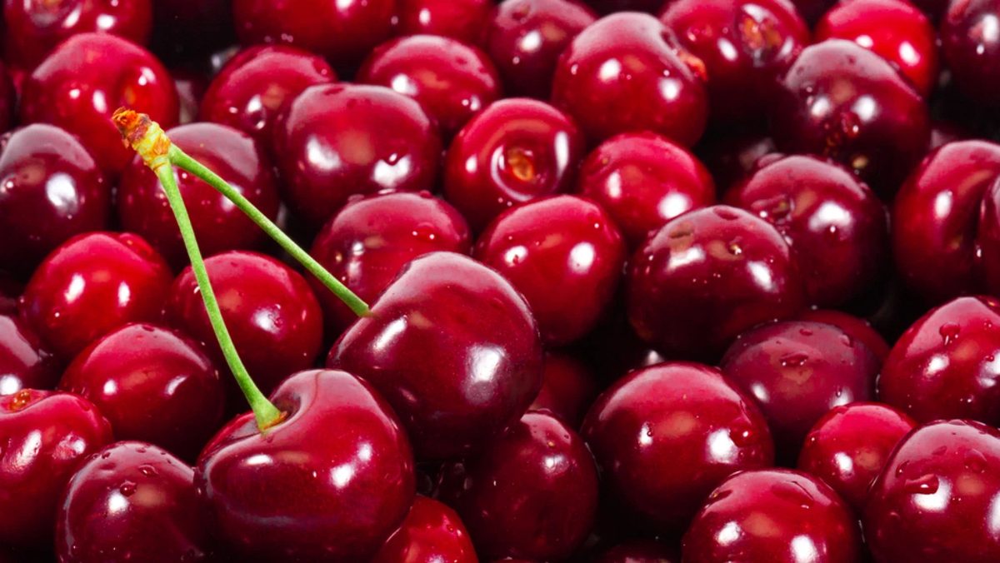 | 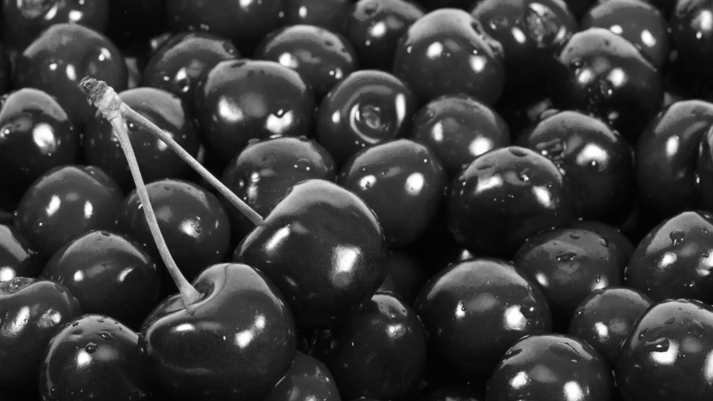 | 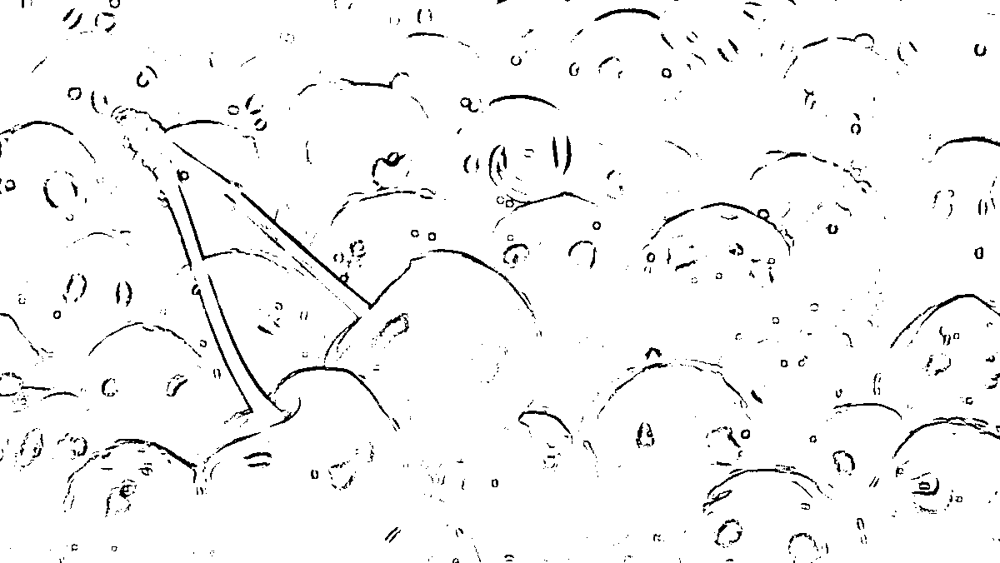 |
|:------------------------------------------------------:|:-----------------------------------------------:|:---------------------------------------------------:|
|                        Оригинал                        |                 Градации серого                 |         Бинаризация методом Сингха (k=0.5)          |

### 2. Buisness

|  |  | 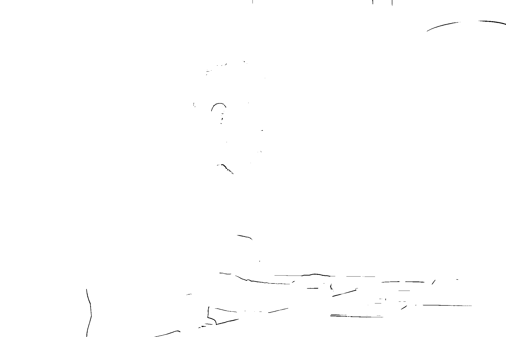 |
|:----------------------------------------------------------------:|:---------------------------------------------------------:|:-----------------------------------------------------------:|
|                           Оригинал                               |                    Градации серого                        |            Бинаризация методом Сингха (k=0.5)               |

### 3. Qiwi

|  | 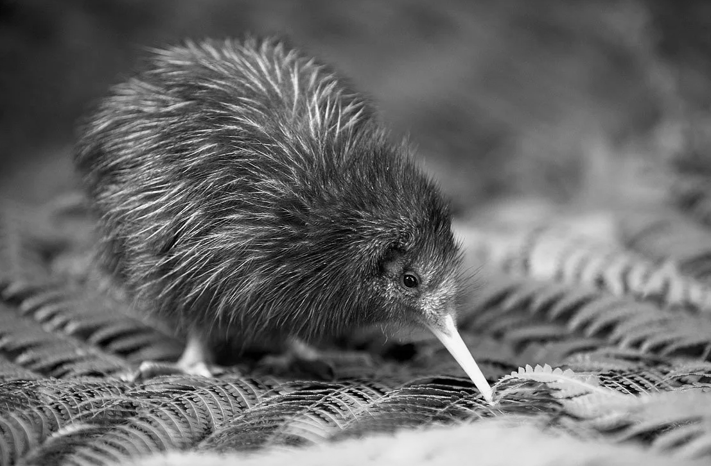 | 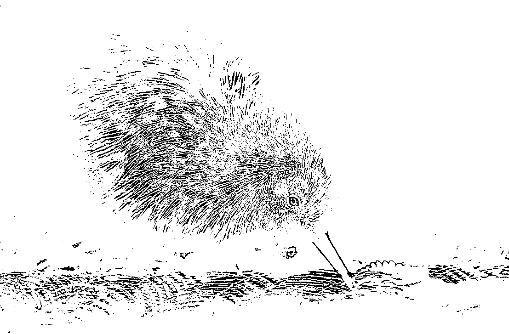 |
|:---------------------------------------------------:|:--------------------------------------------:|:-----------------------------------------------:|
|                       Оригинал                      |                Градации серого               |        Бинаризация методом Сингха (k=0.5)       |

### 4. Chess

| 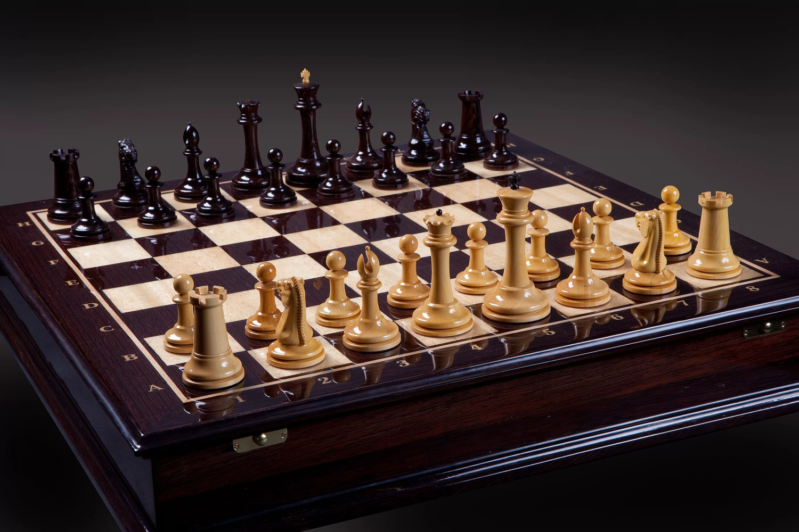 | 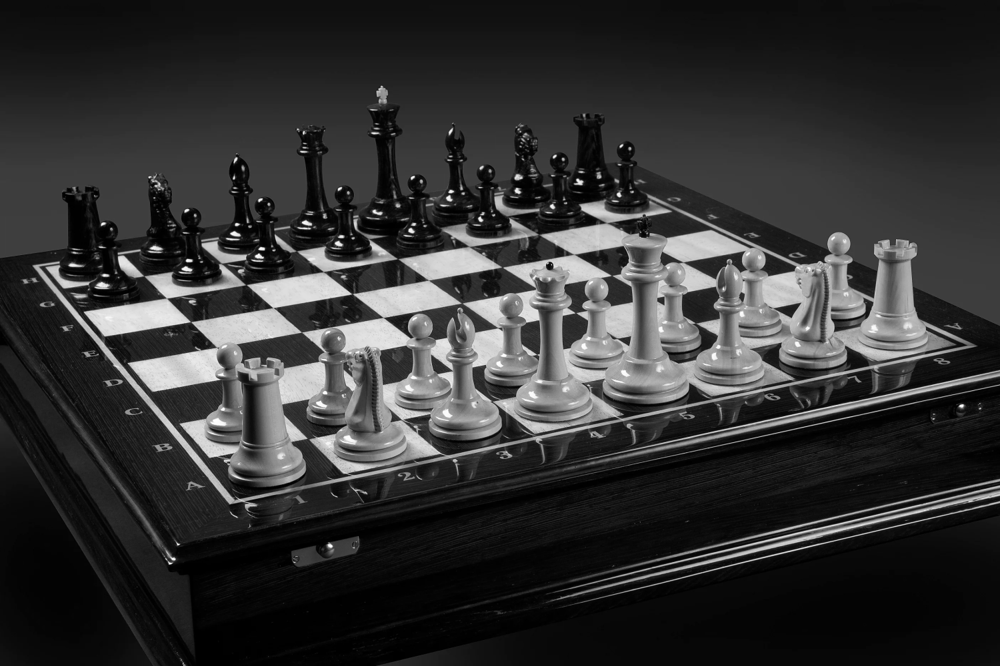 | 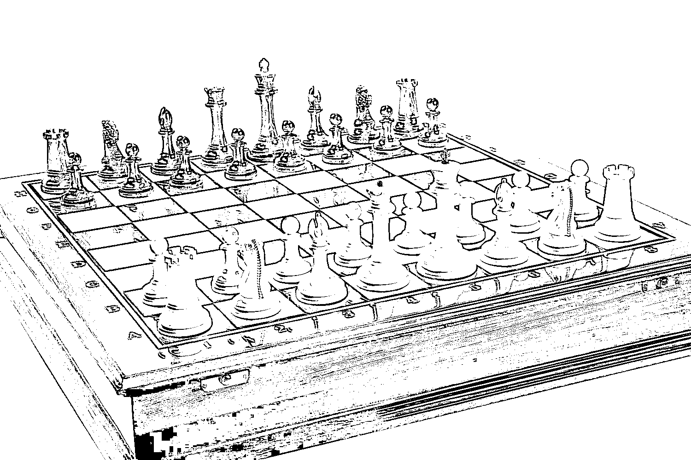 |
|:------------------------------------------------------:|:-----------------------------------------------:|:---------------------------------------------------:|
|                        Оригинал                        |                 Градации серого                 |         Бинаризация методом Сингха (k=0.5)          |

### 5. Zebra

|  | 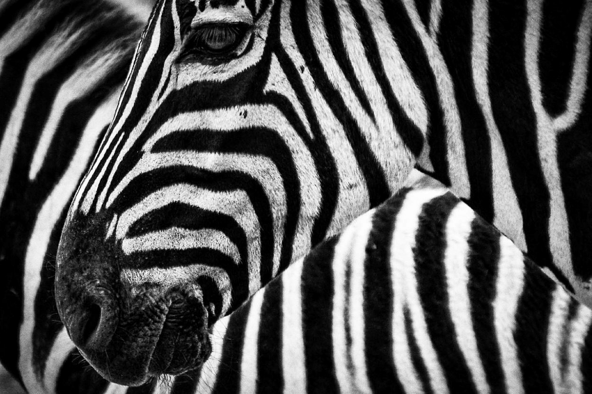 | 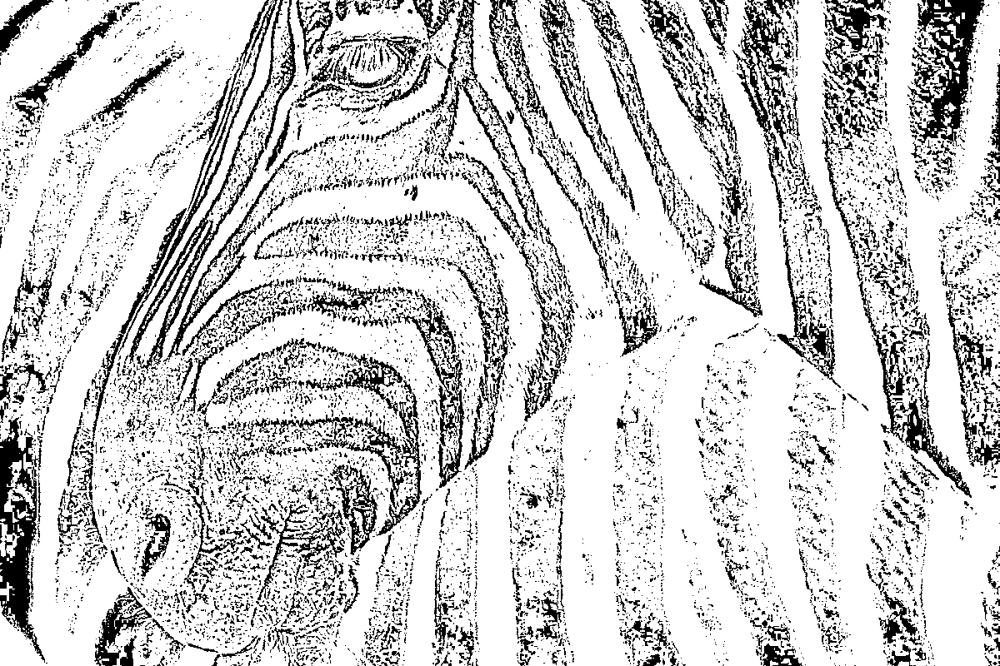 |
|:------------------------------------------------------:|:-----------------------------------------------:|:---------------------------------------------------:|
|                        Оригинал                        |                 Градации серого                 |         Бинаризация методом Сингха (k=0.5)          |

## Описание

Лабораторная работа направлена на реализацию алгоритмов обесцвечивания и бинаризации изображений. В ходе работы выполнены следующие задачи:

1. Приведение полноцветного изображения к полутоновому методом взвешенного усреднения каналов.
2. Приведение полутонового изображения к монохромному методом адаптивной бинаризации Сингха.

## Алгоритмы

### 1. Обесцвечивание через взвешенное усреднение RGB-каналов

Для преобразования цветного изображения в полутоновое используется взвешенное усреднение RGB-каналов с коэффициентами согласно стандарту ITU-R BT.601:
```
Y = 0.299*R + 0.587*G + 0.114*B
```
где Y - яркость пикселя в полутоновом изображении, R, G, B - значения красного, зеленого и синего каналов соответственно.

### 2. Адаптивная бинаризация Сингха

Алгоритм Сингха представляет собой вариацию алгоритмов Ниблэка и Саувола. Формула расчета порога Сингха:
```
T(x,y) = m(x,y) * [1 + k * ((δ(x,y)/S) - 1)]
```
где:
- T(x,y) - порог для пикселя с координатами (x,y)
- m(x,y) - среднее значение яркости в локальном окне вокруг пикселя
- δ(x,y) - стандартное отклонение яркости в локальном окне, рассчитывается как δ(x,y) = I(x,y) - m(x,y)
- S - глобальное стандартное отклонение яркости во всем изображении
- k - константа, управляющая чувствительностью алгоритма (в данной реализации k=0.5)

После расчета порога, бинаризация выполняется по правилу:
```
B(x,y) = 255, если I(x,y) > T(x,y)
B(x,y) = 0, в противном случае
```
где B(x,y) - значение пикселя в бинарном изображении, I(x,y) - значение пикселя в полутоновом изображении.

## Анализ результатов

### 1. Обесцвечивание
Алгоритм обесцвечивания через взвешенное усреднение хорошо сохраняет детали изображения и обеспечивает естественное восприятие яркости. Это заметно на всех типах изображений, особенно на фотографиях с плавными переходами цвета.

В отличие от простой глобальной бинаризации, адаптивный метод Сингха учитывает локальные особенности изображения, что позволяет получить более качественные результаты даже при сложных условиях освещения и качества исходного изображения.

## Начало работы

```
pip install -r lab1/requirements.txt
```

## Использование

Для запуска программы выполните следующую команду:

```bash
python3 main.py
```

Результаты обработки будут сохранены в директории `results` в отдельных папках для каждого изображения:
- `*_original.png` - исходное изображение
- `*_gray.bmp` - полутоновое изображение
- `*_binary.bmp` - бинарное изображение
- `*_comparison.png` - сравнение всех трех изображений 