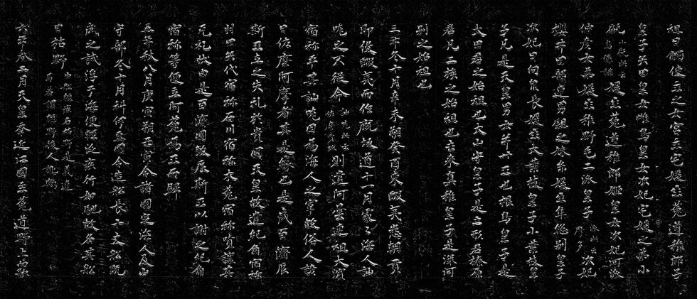
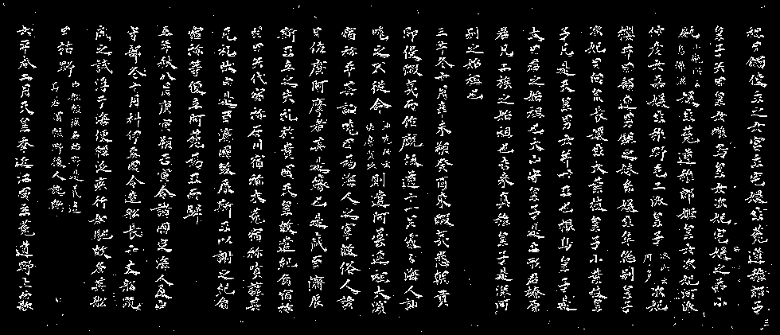
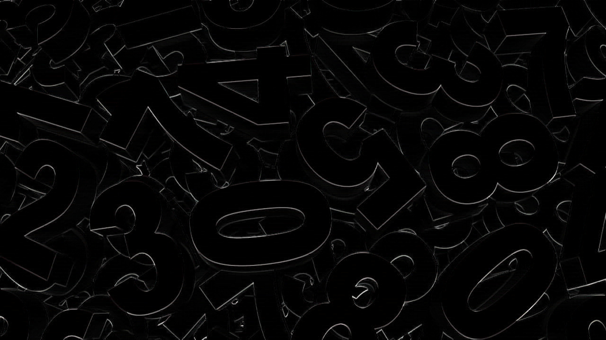
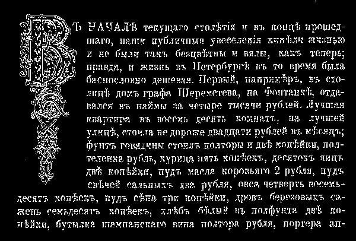

## Лабораторная работа №3. Фильтрация изображений и морфологические операции

### Описание реализации

Для реализации рангового фильтра с маской "прямой крест" использован оригинальный алгоритм без применения готовых функций фильтрации из библиотек компьютерного зрения.

#### Особенности реализации:

1. **Собственная реализация рангового фильтра** - вместо использования OpenCV разработаны собственные алгоритмы обработки изображений.
2. **Параллельная обработка данных** - для ускорения обработки изображений применяется многопоточность:
   - Параллельная обработка каналов для цветных изображений
   - Декомпозиция изображения на пакеты строк для параллельной обработки
3. **Оптимизации алгоритма**:
   - Отдельная обработка внутренних пикселей без проверки границ
   - Эффективное распределение нагрузки между потоками
   - Отображение прогресса обработки
4. **Визуализация** - создается наглядное изображение маски "прямой крест"

#### Используемые библиотеки:
- NumPy - для эффективной работы с массивами данных
- Pillow (PIL) - для загрузки и сохранения изображений
- concurrent.futures - для параллельной обработки данных

Маска "прямой крест" 5x5 содержит только пиксели, расположенные на вертикальной и горизонтальной линиях от центрального пикселя (всего 9 пикселей).

### 1. Chinazes

|  |  |  |
|:----------------------------------------------------------:|:----------------------------------------------------------:|:-------------------------------------------------------------:|
|                         Оригинал                           |                   Ранговый фильтр (ранг 7)                 |                       Разностное изображение                   |

|  |  |  |
|:------------------------------------------------------------------:|:------------------------------------------------------------------:|:---------------------------------------------------------------------:|
|                      Градации серого (оригинал)                    |            Градации серого (ранговый фильтр, ранг 7)               |                  Градации серого (разность)                           |

|  |  |  |
|:--------------------------------------------------------------------:|:--------------------------------------------------------------------:|:-----------------------------------------------------------------------:|
|                          Монохромное (оригинал)                      |              Монохромное (ранговый фильтр, ранг 7)                   |                  Монохромное (разность)                                 |

### 2. Digits

|  |  |  |
|:--------------------------------------------------------:|:--------------------------------------------------------:|:------------------------------------------------------------:|
|                        Оригинал                          |                 Ранговый фильтр (ранг 7)                |                     Разностное изображение                   |

|  |  |  |
|:----------------------------------------------------------------:|:----------------------------------------------------------------:|:-------------------------------------------------------------------:|
|                    Градации серого (оригинал)                    |            Градации серого (ранговый фильтр, ранг 7)             |                  Градации серого (разность)                          |

|  |  |  |
|:------------------------------------------------------------------:|:------------------------------------------------------------------:|:---------------------------------------------------------------------:|
|                        Монохромное (оригинал)                      |              Монохромное (ранговый фильтр, ранг 7)                 |                  Монохромное (разность)                               |

### 3. Russian

|  |  |  |
|:---------------------------------------------------------:|:---------------------------------------------------------:|:-------------------------------------------------------------:|
|                         Оригинал                          |                 Ранговый фильтр (ранг 7)                 |                     Разностное изображение                    |

|  |  |  |
|:-----------------------------------------------------------------:|:-----------------------------------------------------------------:|:--------------------------------------------------------------------:|
|                     Градации серого (оригинал)                    |            Градации серого (ранговый фильтр, ранг 7)              |                  Градации серого (разность)                          |

|  |  |  |
|:-------------------------------------------------------------------:|:-------------------------------------------------------------------:|:-----------------------------------------------------------------------:|
|                         Монохромное (оригинал)                      |              Монохромное (ранговый фильтр, ранг 7)                  |                  Монохромное (разность)                                |

## Описание

Лабораторная работа направлена на реализацию алгоритма фильтрации монохромных, полутоновых и цветных изображений с использованием рангового фильтра. В ходе работы выполнены следующие задачи:

1. Преобразование изображений в монохромные с помощью пороговой бинаризации
2. Реализация рангового фильтра с маской "прямой крест" размером 5x5 и рангом 7
3. Применение фильтра к монохромным изображениям
4. Применение фильтра к полутоновым изображениям
5. Применение фильтра к цветным изображениям (к каждому каналу отдельно)
6. Вычисление разностного изображения как модуля разности между исходным и фильтрованным изображениями

## Алгоритмы

### 1. Преобразование в монохромное изображение

Для преобразования полутонового изображения в монохромное используется пороговая бинаризация:

```python
def convert_to_monochrome(gray_image, threshold=127):
    """
    Преобразует полутоновое изображение в монохромное с помощью бинаризации
    """
    binary_image = np.where(gray_image > threshold, 255, 0).astype(np.uint8)
    return binary_image
```

### 2. Ранговый фильтр

Ранговый фильтр - это нелинейный фильтр, который работает следующим образом:
1. Для каждого пикселя изображения выбирается окрестность согласно заданной маске.
2. Значения пикселей в окрестности сортируются по возрастанию.
3. Выбирается значение с заданным рангом (порядковым номером) в отсортированном списке.

В данной реализации используется маска "прямой крест" размером 5x5, которая включает только пиксели, расположенные по вертикали и горизонтали от центрального пикселя (всего 9 пикселей), и ранг 7, что означает, что из отсортированных значений пикселей выбирается 7-е по величине.

Маска "прямой крест" 5x5 выглядит следующим образом:
```
        (0,-2)
        (0,-1)
(-2,0) (-1,0) (0,0) (1,0) (2,0)
        (0,1)
        (0,2)
```

```python
def get_straight_cross_neighbors(img, x, y):
    """
    Получает значения пикселей в окрестности "прямой крест"
    """
    neighbors = []
    height, width = img.shape
    
    # Горизонтальная линия креста
    for dx in [-2, -1, 0, 1, 2]:
        nx, ny = x + dx, y
        if 0 <= nx < width and 0 <= ny < height:
            neighbors.append(img[ny, nx])
    
    # Вертикальная линия креста (без центра, т.к. он уже добавлен)
    for dy in [-2, -1, 1, 2]:
        nx, ny = x, y + dy
        if 0 <= nx < width and 0 <= ny < height:
            neighbors.append(img[ny, nx])
    
    return sorted(neighbors)

def rank_filter(image, rank=7):
    """
    Применяет ранговый фильтр с маской "прямой крест" и заданным рангом
    """
    height, width = image.shape
    filtered_image = np.zeros((height, width), dtype=np.uint8)
    
    for y in range(height):
        for x in range(width):
            neighbors = get_straight_cross_neighbors(image, x, y)
            filtered_image[y, x] = neighbors[min(rank - 1, len(neighbors) - 1)]
    
    return filtered_image
```

### 3. Вычисление разностного изображения

Разностное изображение вычисляется как модуль разности между исходным и фильтрованным изображением:

```python
def difference_image(img1, img2):
    """
    Вычисляет разностное изображение как модуль разности между двумя изображениями
    """
    return np.abs(img1.astype(np.int16) - img2.astype(np.int16)).astype(np.uint8)
```

## Анализ результатов

### Эффекты рангового фильтра с прямым крестом 5x5 и рангом 7

Ранговый фильтр с прямым крестом 5x5 и рангом 7 имеет следующие характеристики:
- Выбирается 7-й элемент из отсортированных значений (если все 9 соседей доступны)
- Эффект фильтра похож на комбинацию морфологических операций
- Фильтр обрабатывает изображение вдоль вертикальных и горизонтальных направлений, сохраняя больше структурной информации, чем полная окрестность 5x5
- Светлые области на изображении имеют тенденцию расширяться вдоль вертикальных и горизонтальных направлений
- Мелкие темные детали удаляются, особенно если они расположены горизонтально или вертикально
- Фильтр эффективно убирает шум типа "соль и перец" вдоль осей

## Начало работы

```bash
pip install -r requirements.txt
```

## Использование

Для запуска программы выполните следующую команду:

```bash
python3 main.py
```

Результаты обработки сохраняются в директории `results` в отдельных папках для каждого изображения:
- `original_monochrome.png` - исходное монохромное изображение
- `filtered_monochrome.png` - монохромное изображение после применения рангового фильтра
- `difference_monochrome.png` - разностное изображение для монохромного изображения
- `original_grayscale.png` - исходное изображение в градациях серого
- `filtered_grayscale.png` - изображение в градациях серого после применения рангового фильтра
- `difference_grayscale.png` - разностное изображение для изображения в градациях серого
- `original_color.png` - исходное цветное изображение
- `filtered_color.png` - цветное изображение после применения рангового фильтра
- `difference_color.png` - разностное изображение для цветного изображения 