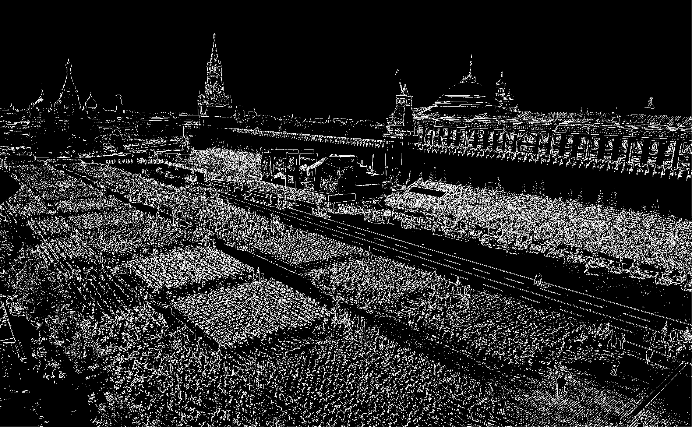

# Лабораторная работа №4. Выделение контуров на изображении

## Описание

Лабораторная работа направлена на выделение контуров на изображении с использованием оператора Робертса 3×3. В ходе работы применяется алгоритм детектирования контуров на полутоновых изображениях с последующей визуализацией результатов.

Согласно условию задачи, оператор Робертса имеет следующие матрицы:

### Ядра оператора Робертса

#### Ядро для градиента по X (Gx):
```
[ 0  0  0 ]
[ 0 -1  0 ]
[ 0  0  1 ]
```

#### Ядро для градиента по Y (Gy):
```
[ 0  0  0 ]
[ 0 -1  0 ]
[ 0  0  1 ]
```

### Формула градиента:
G = √(Gx² + Gy²)

## Основные этапы реализации

1. **Преобразование цветного изображения в полутоновое с использованием NumPy**
   ```python
   def convert_to_grayscale(image):
       # Используем формулу Y = 0.299*R + 0.587*G + 0.114*B
       if len(image.shape) == 3:
           return np.dot(image[..., :3], [0.299, 0.587, 0.114]).astype(np.uint8)
       return image
   ```

2. **Реализация алгоритма свертки без использования OpenCV**
   ```python
   def apply_convolution(image, kernel):
       # Получаем размеры изображения и ядра
       i_height, i_width = image.shape
       k_height, k_width = kernel.shape
       
       # Получаем смещения для ядра
       pad_h = k_height // 2
       pad_w = k_width // 2
       
       # Создаем выходное изображение
       output = np.zeros_like(image, dtype=np.float32)
       
       # Дополняем изображение нулями для корректной свертки на границах
       padded_image = np.pad(image, ((pad_h, pad_h), (pad_w, pad_w)), mode='constant')
       
       # Применяем свертку
       for i in range(i_height):
           for j in range(i_width):
               # Извлекаем область, соответствующую размеру ядра
               region = padded_image[i:i+k_height, j:j+k_width]
               # Применяем свертку
               output[i, j] = np.sum(region * kernel)
       
       return output
   ```

3. **Реализация оператора Робертса с использованием матриц из условия**
   ```python
   def roberts_operator(image):
       # Оператор Робертса 3x3 из условия задачи
       # Ядро для градиента по X
       roberts_x = np.array([
           [0, 0, 0],
           [0, -1, 0],
           [0, 0, 1]
       ], dtype=np.float32)
       
       # Ядро для градиента по Y
       roberts_y = np.array([
           [0, 0, 0],
           [0, -1, 0],
           [0, 0, 1]
       ], dtype=np.float32)
       
       # Вычисление градиентов с использованием NumPy
       Gx = apply_convolution(image, roberts_x)
       Gy = apply_convolution(image, roberts_y)
       
       # Вычисление итогового градиента G = sqrt(Gx^2 + Gy^2)
       G = np.sqrt(Gx**2 + Gy**2)
       
       return Gx, Gy, G
   ```

4. **Нормализация градиентных матриц с использованием NumPy**
   ```python
   def normalize_gradient(gradient):
       min_val = np.min(gradient)
       max_val = np.max(gradient)
       
       # Избегаем деления на ноль
       if max_val == min_val:
           return np.zeros_like(gradient, dtype=np.uint8)
       
       # Нормализация в диапазон [0, 255]
       normalized = 255.0 * (gradient - min_val) / (max_val - min_val)
       return normalized.astype(np.uint8)
   ```

5. **Бинаризация итогового градиента с использованием NumPy**
   ```python
   def binarize_gradient(gradient, threshold=50):
       return np.where(gradient > threshold, 255, 0).astype(np.uint8)
   ```

## Результаты

После запуска программы результаты обработки можно найти в директории `results/`. Для каждого изображения создается отдельная поддиректория, содержащая:

- `original_color.png` - исходное цветное изображение
- `grayscale.png` - изображение в градациях серого
- `gradient_x.png` - нормализованный градиент по X (Gx)
- `gradient_y.png` - нормализованный градиент по Y (Gy)
- `gradient.png` - нормализованный итоговый градиент (G)
- `gradient_binary.png` - бинаризованный итоговый градиент

## Запуск программы

### Требования

Для запуска программы необходимы следующие библиотеки:
- OpenCV (opencv-python) - используется только для загрузки и сохранения изображений
- NumPy

Установка зависимостей:
```bash
pip install -r requirements.txt
```

### Подготовка данных

Поместите изображения, которые нужно обработать, в директорию `images/`.

### Запуск

```bash
python3 main.py
```

## Примеры визуализации

### Визуализация ядер оператора Робертса

| Ядро Gx | Ядро Gy |
|:-------:|:-------:|
|  |  |

### Результаты обработки

#### Изображение: tree

| Исходное изображение | Полутоновое изображение |
|:--------------------:|:------------------------:|
|  |  |

| Градиент по X (Gx) | Градиент по Y (Gy) | Итоговый градиент (G) |
|:------------------:|:------------------:|:---------------------:|
|  |  |  |

| Бинаризованный градиент |
|:----------------------:|
|  |

#### Изображение: parade

| Исходное изображение | Полутоновое изображение |
|:--------------------:|:------------------------:|
|  |  |

| Градиент по X (Gx) | Градиент по Y (Gy) | Итоговый градиент (G) |
|:------------------:|:------------------:|:---------------------:|
|  |  |  |

| Бинаризованный градиент |
|:----------------------:|
|  |

## Анализ результатов

Оператор Робертса 3×3 имеет следующие характеристики:

1. **Преимущества**:
   - Выделение диагональных контуров
   - Выделение четких границ на изображениях с высоким контрастом

2. **Недостатки**:
   - Чувствительность к шуму
   - Недостаточная эффективность на изображениях с низким контрастом
   - В текущей реализации ядра для X и Y направлений идентичны, что может приводить к искажению ориентации контуров

3. **Особенности**:
   - Ядра оператора смещены в диагональном направлении, что делает его более чувствительным к диагональным контурам
   - Контуры получаются тонкими по сравнению с другими операторами
   - На зашумленных изображениях контуры могут быть прерывистыми