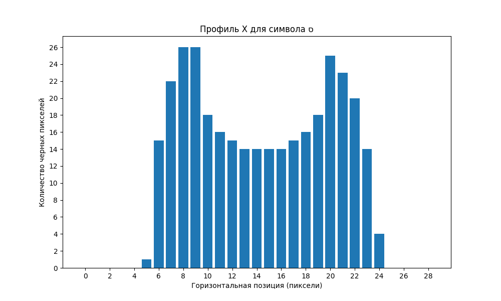
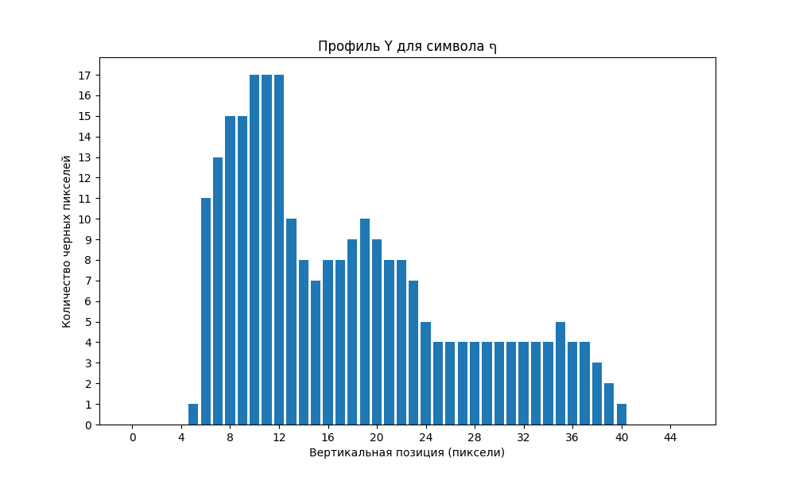

# Отчет по лабораторной работе №5
## Выделение признаков символов

### Задание
Работа выполнена для алфавита иврит.

## 1. Генерация эталонных изображений символов

Для создания эталонных изображений символов иврита использован шрифт Hebrew.ttf с размером 52 пункта. Были сгенерированы изображения для всех букв иврита (от Алеф (א) до Тав (ת)).

Каждое изображение сохранено в формате PNG и обрезано так, чтобы убрать лишние белые поля. Изображения сохранены по принципу "1 символ - 1 файл" в директории `symbols/originals`.

Пример сгенерированных символов:

## 2. Расчет набора признаков

Для каждого изображения были рассчитаны следующие признаки:

### а) Вес (масса черного) каждой четверти изображения=

### б) Удельный вес

### в) Координаты центра тяжести

### г) Нормированные координаты центра тяжести

### д) Осевые моменты инерции

### е) Нормированные осевые моменты инерции

### ж) Профили X и Y

## 3. Сохранение результатов

### 3.1 Скалярные признаки

Все скалярные признаки сохранены в файл CSV-формата. Файл находится в директории `results/features.csv`.

Ниже приведена таблица признаков для всех символов:

| Символ (Unicode) | Вес Q1 | Вес Q2 | Вес Q3 | Вес Q4 | Уд. вес Q1 | Уд. вес Q2 | Уд. вес Q3 | Уд. вес Q4 | Центр X | Центр Y | Норм. X | Норм. Y | Момент X | Момент Y | Норм. момент X | Норм. момент Y |
|------------------|--------|--------|--------|--------|------------|------------|------------|------------|---------|---------|---------|---------|---------|---------|---------------|---------------|
| Алеф (1488)      | 74     | 81     | 79     | 91     | 0.243      | 0.266      | 0.247      | 0.284      | 16.26   | 19.22   | 0.508   | 0.493   | 18511.5 | 13399.8 | 0.037         | 0.040         |
| Бет (1489)       | 49     | 89     | 51     | 98     | 0.184      | 0.312      | 0.192      | 0.344      | 15.75   | 19.80   | 0.543   | 0.521   | 26157.1 | 7011.9  | 0.063         | 0.029         |
| Гимель (1490)    | 29     | 51     | 36     | 68     | 0.127      | 0.224      | 0.158      | 0.298      | 12.59   | 20.15   | 0.525   | 0.530   | 12789.0 | 1726.4  | 0.048         | 0.016         |
| Далет (1491)     | 61     | 96     | 0      | 53     | 0.214      | 0.316      | 0.000      | 0.174      | 16.20   | 13.70   | 0.523   | 0.361   | 11118.1 | 4478.2  | 0.037         | 0.022         |
| Хе (1492)        | 54     | 93     | 47     | 50     | 0.203      | 0.326      | 0.177      | 0.175      | 15.46   | 16.11   | 0.533   | 0.424   | 15379.2 | 8110.6  | 0.044         | 0.040         |
| Вав (1493)       | 22     | 46     | 0      | 51     | 0.129      | 0.269      | 0.000      | 0.298      | 9.82    | 17.39   | 0.546   | 0.458   | 6432.4  | 331.3   | 0.037         | 0.009         |
| Заин (1494)      | 53     | 34     | 46     | 20     | 0.279      | 0.179      | 0.230      | 0.100      | 8.81    | 17.69   | 0.441   | 0.454   | 9524.6  | 765.5   | 0.041         | 0.013         |
| Хет (1495)       | 88     | 90     | 50     | 50     | 0.309      | 0.316      | 0.175      | 0.175      | 15.32   | 16.08   | 0.511   | 0.423   | 15317.1 | 10066.5 | 0.038         | 0.040         |
| Тет (1496)       | 57     | 74     | 81     | 73     | 0.200      | 0.260      | 0.284      | 0.256      | 15.43   | 19.91   | 0.514   | 0.524   | 18684.8 | 9967.8  | 0.045         | 0.039         |
| Йод (1497)       | 21     | 33     | 10     | 27     | 0.156      | 0.244      | 0.074      | 0.200      | 9.36    | 13.96   | 0.520   | 0.465   | 2205.8  | 295.0   | 0.027         | 0.010         |
| Каф софит (1498) | 46     | 101    | 0      | 70     | 0.154      | 0.314      | 0.000      | 0.217      | 16.60   | 17.71   | 0.615   | 0.385   | 22670.7 | 4107.9  | 0.049         | 0.026         |
| Каф (1499)       | 43     | 83     | 41     | 74     | 0.174      | 0.312      | 0.166      | 0.278      | 14.69   | 18.68   | 0.544   | 0.492   | 19524.0 | 4879.7  | 0.056         | 0.028         |

*Примечание: Таблица содержит только первые 12 символов. Полная таблица доступна в файле CSV.*

### 3.2 Профили

Для каждого символа созданы горизонтальный и вертикальный профили в виде столбчатых диаграмм.

Ниже представлены профили для всех символов иврита:

#### Алеф (א - Unicode: 1488)
Профиль X:

Профиль Y:

#### Бет (ב - Unicode: 1489)
Профиль X:

Профиль Y:

#### Гимель (ג - Unicode: 1490)
Профиль X:

Профиль Y:

#### Далет (ד - Unicode: 1491)
Профиль X:

Профиль Y:

#### Хе (ה - Unicode: 1492)
Профиль X:

Профиль Y:

#### Вав (ו - Unicode: 1493)
Профиль X:

Профиль Y:

#### Заин (ז - Unicode: 1494)
Профиль X:

Профиль Y:

#### Хет (ח - Unicode: 1495)
Профиль X:

Профиль Y:

#### Тет (ט - Unicode: 1496)
Профиль X:

Профиль Y:

#### Йод (י - Unicode: 1497)
Профиль X:

Профиль Y:

#### Каф софит (ך - Unicode: 1498)
Профиль X:

Профиль Y:

#### Каф (כ - Unicode: 1499)
Профиль X:

Профиль Y:

#### Ламед (ל - Unicode: 1500)
Профиль X:

Профиль Y:

#### Мем софит (ם - Unicode: 1501)
Профиль X:

Профиль Y:

#### Мем (מ - Unicode: 1502)
Профиль X:

Профиль Y:

#### Нун софит (ן - Unicode: 1503)
Профиль X:

Профиль Y:

#### Нун (נ - Unicode: 1504)
Профиль X:

Профиль Y:

#### Самех (ס - Unicode: 1505)
Профиль X:

Профиль Y:

#### Аин (ע - Unicode: 1506)
Профиль X:

Профиль Y:

#### Пе софит (ף - Unicode: 1507)
Профиль X:

Профиль Y:

#### Пе (פ - Unicode: 1508)
Профиль X:

Профиль Y:

#### Цади софит (ץ - Unicode: 1509)
Профиль X:

Профиль Y:

#### Цади (צ - Unicode: 1510)
Профиль X:

Профиль Y:

#### Коф (ק - Unicode: 1511)
Профиль X:

Профиль Y:

#### Реш (ר - Unicode: 1512)
Профиль X:

Профиль Y:

#### Шин (ש - Unicode: 1513)
Профиль X:

Профиль Y:

#### Тав (ת - Unicode: 1514)
Профиль X:

Профиль Y:

## Выводы

В ходе выполнения лабораторной работы были успешно сгенерированы эталонные изображения символов иврита, для каждого изображения рассчитаны набор признаков и построены профили.

