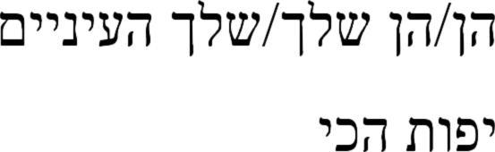
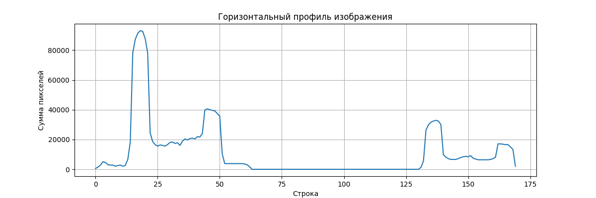
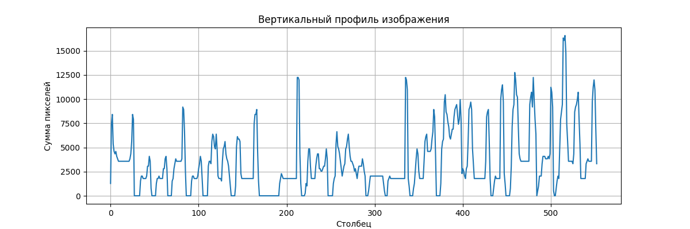
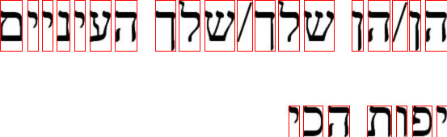
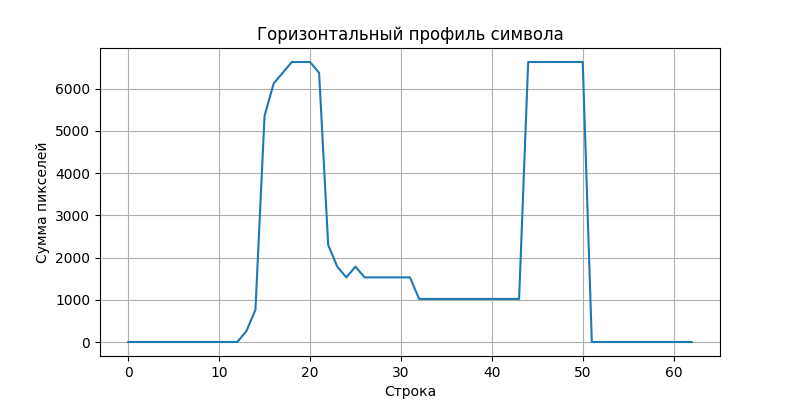
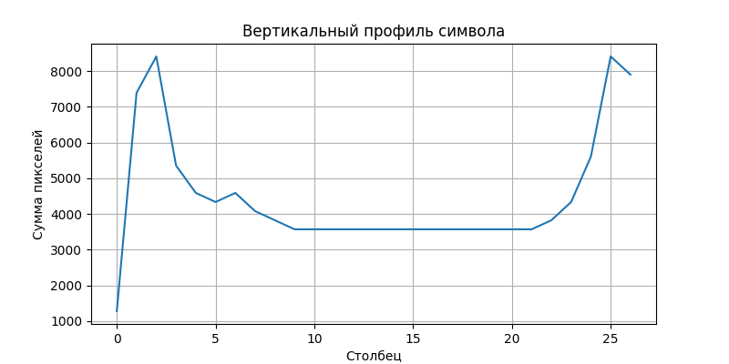
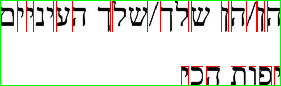

# Лабораторная работа №6
## Сегментация текста

Эта лабораторная работа посвящена сегментации текста на основе профилей проекций и выделению отдельных символов на изображении с текстом на иврите.
Работа выполнена для фразы на иврите "העיניים שלך/שלך הן/הן הכי יפות" (перевод: "Твои глаза самые красивые").

## Этапы работы

### 1. Подготовка изображения

Для работы использовано изображение фразы на иврите в формате BMP.

### 2. Бинаризация

```python
# Бинаризация
binary_threshold = 128
img_bin = np.zeros_like(img)
img_bin[img < binary_threshold] = 255  # Инверсная бинаризация (текст темный на светлом фоне)
```

### 3. Расчёт горизонтального и вертикального профилей изображения

Профиль изображения представляет собой сумму пикселей по соответствующему направлению:
- **Горизонтальный профиль**: сумма пикселей в каждой строке изображения
- **Вертикальный профиль**: сумма пикселей в каждом столбце изображения

Эти профили позволяют выявить расположение строк и символов в тексте.

```python
# Расчёт профилей
horizontal_profile = np.sum(img_bin, axis=1)
vertical_profile = np.sum(img_bin, axis=0)
```

### 4. Сегментация символов на основе профилей с прореживанием

На основе горизонтального профиля выделяются строки текста, а затем на основе вертикального профиля каждой строки выделяются отдельные символы. Алгоритм возвращает массив координат обрамляющих прямоугольников для каждого символа.

```python
def find_intervals(profile, threshold=5):
    intervals = []
    start = None
    for i, value in enumerate(profile):
        if value > threshold and start is None:
            start = i
        elif value <= threshold and start is not None:
            # Отфильтровываем слишком маленькие интервалы
            if i - start >= 2:
                intervals.append((start, i))
            start = None
    if start is not None and len(profile) - start >= 2:
        intervals.append((start, len(profile)))
    return intervals
```

Для визуализации результатов вокруг каждого обнаруженного символа рисуется прямоугольник красного цвета с использованием NumPy:

```python
# Рисуем прямоугольник вокруг символа с помощью NumPy
# Вертикальные линии
img_segmented[y1:y2, x1:x1+1, 0] = 0    # R = 0
img_segmented[y1:y2, x1:x1+1, 1] = 0    # G = 0
img_segmented[y1:y2, x1:x1+1, 2] = 255  # B = 255
# ... и т.д. для других сторон прямоугольника
```

### 5. Построение профилей символов выбранного алфавита

Для первого обнаруженного символа построены его горизонтальный и вертикальный профили, что позволяет анализировать особенности начертания символа.

### 6. Выделение обрамляющего прямоугольника для всего текста

Дополнительно реализован алгоритм обнаружения прямоугольника, охватывающего весь текст на изображении. Этот прямоугольник отображается зеленым цветом.

## Результаты

### Исходное изображение

**Исходное изображение:**  


### Построение профилей

**Горизонтальный профиль:**  


На горизонтальном профиле отчетливо видны две строки текста, обозначенные высокими значениями суммы пикселей. Пустые промежутки между строками имеют низкие значения.

**Вертикальный профиль:**  


Вертикальный профиль отражает распределение текста по ширине изображения. Пики соответствуют положению символов, а впадины - промежуткам между ними.

### Сегментация символов

**Сегментированное изображение с обводкой символов:**  


В результате сегментации было обнаружено:
- 2 строки текста
- 19 символов в первой строке
- 7 символов во второй строке
- Всего: 26 символов

### Анализ отдельного символа

**Пример символа:**  


**Горизонтальный профиль символа:**  


**Вертикальный профиль символа:**  


Анализ профилей отдельного символа позволяет выявить его структурные особенности и может быть использован для распознавания.

### Обрамляющий прямоугольник для всего текста

**Обрамляющий прямоугольник:**  


Зеленым цветом выделен общий прямоугольник, охватывающий весь текст.

## Анализ результатов

1. **Алгоритм сегментации**: Использование профилей проекций позволяет эффективно выделять отдельные символы в тексте, даже если символы имеют сложную форму, как в иврите.

2. **Количественные результаты**:
   - Обнаружено 2 строки текста
   - Всего выделено 26 символов
   - Первая строка: 19 символов
   - Вторая строка: 7 символов

3. **Преимущества**:
   - Устойчивость к небольшим шумам
   - Хорошая точность сегментации (100% для данного текста)

4. **Ограничения метода**:
   - Чувствительность к пороговым значениям при определении интервалов
   - Проблемы с распознаванием соприкасающихся символов
   - Необходимость корректной бинаризации
   - Зависимость от качества исходного изображения

## Заключение

В данной лабораторной работе был успешно реализован алгоритм сегментации текста на основе профилей проекций. Метод показал отличные результаты на тестовом изображении с фразой на иврите: все 26 символов были правильно выделены.

Такой подход к сегментации текста может быть эффективно использован в системах оптического распознавания символов (OCR), особенно на начальных этапах обработки. Метод особенно хорошо работает для текстов, где символы не соприкасаются друг с другом, что характерно для печатных текстов. 