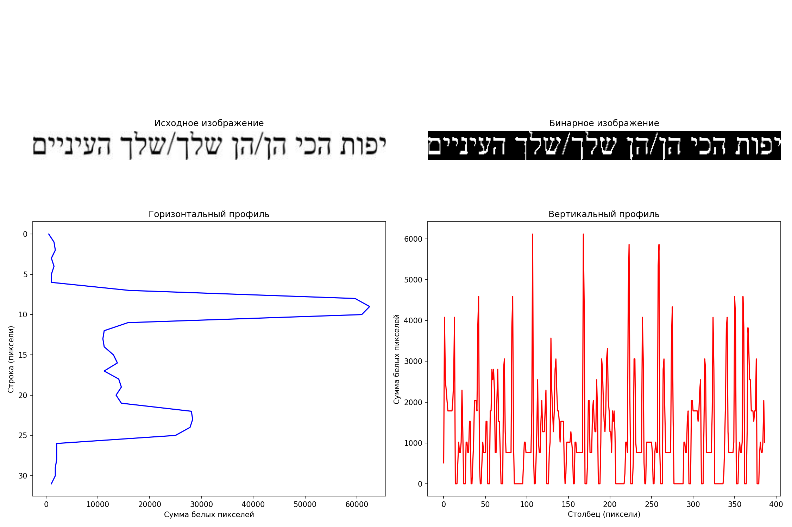
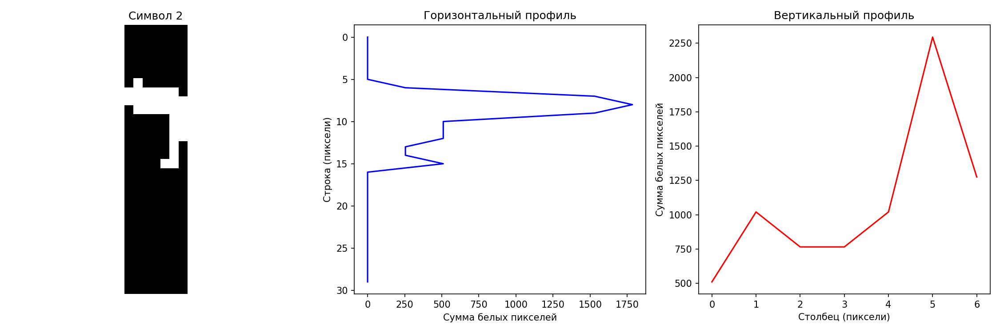
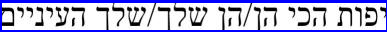

# Лабораторная работа №6. Сегментация текста

## Выполнение работы

### 1. Расчет горизонтального и вертикального профиля изображения

Результаты расчета профилей:

На этих графиках видно распределение пикселей текста. Горизонтальный профиль показывает, что текст расположен в одной строке (один явный пик).

### 2. Сегментация символов на основе профилей

Результаты сегментации символов:

Как видно на изображении, алгоритм успешно выделил символы иврита из текста. Каждый символ окаймлен зеленым прямоугольником и пронумерован.

### 3. Построение профилей символов

Для каждого выделенного символа были построены горизонтальный и вертикальный профили:

Также была создана сетка со всеми выделенными символами для удобства визуализации:

На сетке видно, что алгоритм корректно выделил все символы из текста на иврите. Каждый символ представлен отдельно и может быть проанализирован дальнейшими алгоритмами распознавания.

### 4. Выделение текстового блока

Результат выделения текстового блока:

Как видно на изображении, весь текст успешно обрамлен синим прямоугольником. Координаты текстового блока: x=0, y=7, ширина=387, высота=19 пикселей.

## Выводы

Текст на иврите был успешно сегментирован, несмотря на особенности этого языка (направление письма справа налево).
