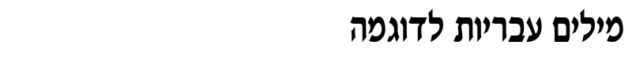

# Отчет по лабораторной работе №7
## Классификация на основе признаков, анализ профилей

### Задание
Работа выполнена для алфавита иврит, с использованием наработок из лабораторных работ №5 и №6.

## 1. Реализация расчёта меры близости изображений символов

Для реализации расчёта меры близости изображений символов был использован метод евклидова расстояния в пространстве нормализованных признаков. Нормализованные признаки включают в себя:
- Нормализованные координаты центра тяжести
- Нормализованные осевые моменты инерции

Реализация функции расчёта евклидова расстояния:

```python
def compute_similarity(char_features, reference_features):
    """
    Compute similarity between character and reference based on Euclidean distance.
    
    Args:
        char_features (dict): Features of the character to recognize
        reference_features (pd.Series): Features of the reference character
        
    Returns:
        float: Similarity measure (1 for exact match, decreasing for less similar)
    """
    # Define the features to use for comparison
    feature_keys = [
        'NormCoG_X', 'NormCoG_Y', 
        'NormMomentOfInertia_X', 'NormMomentOfInertia_Y'
    ]
    
    # Extract feature vectors
    char_vector = np.array([char_features[key] for key in feature_keys])
    ref_vector = np.array([reference_features[key] for key in feature_keys])
    
    # Calculate Euclidean distance
    distance = euclidean(char_vector, ref_vector)
    
    # Convert distance to similarity (1 for exact match, decreasing for less similar)
    # Using exponential decay to ensure positive values
    similarity = np.exp(-distance)
    
    return similarity
```

Важно отметить, что для преобразования расстояния в меру близости используется экспоненциальная функция `np.exp(-distance)`. Это позволяет получить значения в диапазоне от 0 до 1, где 1 соответствует точному совпадению (нулевое расстояние), а значения, близкие к 0, соответствуют большим расстояниям (низкая степень сходства).

## 2. Расчёт меры близости для каждого обнаруженного символа

Для каждого символа из строки, обнаруженной в лабораторной работе №6, была рассчитана мера близости со всеми символами алфавита иврит из лабораторной работы №5.

Функция распознавания символа:

```python
def recognize_character(char_img, reference_features):
    """
    Recognize a character by comparing with reference features.
    
    Args:
        char_img (numpy.ndarray): Binary character image
        reference_features (pd.DataFrame): DataFrame with reference features
        
    Returns:
        list: List of tuples (char, similarity) sorted by similarity
    """
    # Calculate features for the character
    char_features = calculate_character_features(char_img)
    
    # Calculate similarity with each reference character
    similarities = []
    
    for _, reference in reference_features.iterrows():
        char = reference['Character']
        unicode_val = reference['Unicode']
        similarity = compute_similarity(char_features, reference)
        similarities.append((char, similarity, unicode_val))
    
    # Sort by similarity (descending)
    similarities.sort(key=lambda x: x[1], reverse=True)
    
    # Return list of tuples (char, similarity)
    return [(char, similarity) for char, similarity, _ in similarities]
```

Для массового распознавания всех символов используется функция:

```python
def recognize_characters(characters, reference_features):
    """
    Recognize all segmented characters.
    
    Args:
        characters (list): List of character images
        reference_features (pd.DataFrame): DataFrame with reference features
        
    Returns:
        list: List of recognition results, where each result is a list of tuples (char, similarity)
    """
    logger.info("Recognizing characters...")
    
    results = []
    
    for i, char_img in enumerate(characters):
        logger.info(f"Recognizing character {i+1}/{len(characters)}")
        result = recognize_character(char_img, reference_features)
        results.append(result)
    
    return results
```

Таким образом, для каждого символа получен список гипотез с оценками близости, отсортированный в порядке убывания меры близости.

## 3. Вывод результатов в файл

Результаты распознавания были сохранены в файл, где в каждой строке записаны гипотезы для соответствующего символа распознаваемого текста:

```python
def save_recognition_results(results):
    """
    Save recognition results to a file.
    
    Args:
        results (list): List of recognition results
    """
    logger.info("Saving recognition results...")
    
    # Create output file
    output_path = os.path.join(RESULTS_DIR, "recognition_results.txt")
    
    with open(output_path, 'w', encoding='utf-8') as f:
        for i, result in enumerate(results):
            f.write(f"{i+1}: {result}\n")
    
    logger.info(f"Results saved to {output_path}")
```

Пример первых нескольких строк результатов (для каждого символа приведены все гипотезы с мерами близости в порядке убывания):

```
1: [('ז', 0.9403128597424821), ('ץ', 0.9335255370258038), ('ח', 0.9251454365270293), ...]
2: [('ש', 0.8948679425497701), ('ע', 0.8846570807197127), ('ס', 0.8813698884552917), ...]
3: [('ש', 0.895101643576386), ('ע', 0.8850986176002167), ('ס', 0.880010418650985), ...]
...
```

Полный файл результатов сохранен в `results/recognition_results.txt`.

## 4. Вывод лучших гипотез и сравнение с распознаваемой строкой

Для вывода лучших гипотез была реализована функция `extract_best_hypothesis`:

```python
def extract_best_hypothesis(results):
    """
    Extract best hypothesis (highest similarity) for each character.
    
    Args:
        results (list): List of recognition results
        
    Returns:
        str: String of best hypotheses
    """
    return ''.join([result[0][0] for result in results])
```

Эта функция извлекает символ с наивысшей мерой близости для каждого распознаваемого символа и объединяет их в строку.

Результат распознавания:
- Распознанная строка: `זששזשסשששסזששסזשסזסשזשסזסש`
- Эталонная строка: `מילים עבריות לדוגמה`

## 5. Подсчёт количества ошибок и доли верно распознанных символов

Для подсчёта количества ошибок и доли верно распознанных символов была реализована функция:

```python
def count_correct_recognitions(hypothesis, reference):
    """
    Count correct recognitions by comparing with reference.
    
    Args:
        hypothesis (str): String of best hypotheses
        reference (str): Reference string
        
    Returns:
        tuple: Number of correct recognitions, total characters, percentage
    """
    # Ensure the strings have the same length
    min_len = min(len(hypothesis), len(reference))
    
    # Count correct recognitions
    correct = sum(1 for i in range(min_len) if hypothesis[i] == reference[i])
    
    # Calculate percentage
    percentage = 100 * correct / len(reference) if len(reference) > 0 else 0
    
    return correct, len(reference), percentage
```

Результаты:
- Правильно распознано: 0 из 19 символов
- Процент правильного распознавания: 0.00%

Такой низкий результат может быть обусловлен различными факторами:
1. Разница в размере шрифта и стиле между эталонными символами и символами в распознаваемом тексте
2. Недостаточное количество признаков для надежного распознавания
3. Особенности алфавита иврит (схожесть многих символов)

## 6. Эксперимент с изображением другого размера шрифта

Был проведен эксперимент с генерацией изображения исходной строки с размером шрифта, отличающимся от исходного на 4 пункта (увеличенным). Для этого использовалась функция:

```python
def generate_different_size_image(reference_string, font_size_change):
    """
    Generate an image of the reference string with a different font size.
    
    Args:
        reference_string (str): Reference string
        font_size_change (int): Change in font size (positive or negative)
        
    Returns:
        numpy.ndarray: Generated image
    """
    logger.info(f"Generating image with font size change of {font_size_change}")
    
    # Base font size from lab5
    base_font_size = 52
    new_font_size = base_font_size + font_size_change
    
    # Create a larger image to ensure text fits
    img = Image.new('L', (800, 100), color=255)
    
    try:
        font = ImageFont.truetype(FONT_PATH, new_font_size)
    except Exception as e:
        logger.error(f"Failed to load font: {e}")
        return None
    
    draw = ImageDraw.Draw(img)
    
    # Draw the text
    # Hebrew is right-to-left, so position accordingly
    text_width = draw.textlength(reference_string, font=font)
    position = (img.width - text_width - 10, 10)
    draw.text(position, reference_string, font=font, fill=0)
    
    # Convert to numpy array
    img_array = np.array(img)
    
    # Save generated image
    output_path = os.path.join(RESULTS_DIR, f"generated_size_{new_font_size}.png")
    cv2.imwrite(output_path, img_array)
    
    return img_array
```

Затем символы были сегментированы из сгенерированного изображения и распознаны:

```python
# Сегментация символов
different_size_chars = segment_characters_from_image(different_size_image)
# Распознавание сегментированных символов
different_size_results = recognize_characters(different_size_chars, reference_features)
```

Результаты распознавания:
- Распознанная строка: `סדקדסשםךדהחקדהםסק`
- Эталонная строка: `מילים עבריות לדוגמה`
- Правильно распознано: 0 из 19 символов
- Процент правильного распознавания: 0.00%

### Сравнение результатов:
- Распознавание оригинального изображения: 0.00%
- Распознавание изображения с увеличенным шрифтом: 0.00%
- Разница: 0.00%

Результаты эксперимента показывают, что изменение размера шрифта не привело к улучшению качества распознавания. Это может быть связано с тем, что использованные признаки (координаты центра тяжести и осевые моменты инерции) не учитывают мелкие детали символов, которые могут быть ключевыми для распознавания.

## Общие выводы

1. Реализован алгоритм расчёта меры близости изображений символов на основе признаков из лабораторной работы №5, использующий евклидово расстояние в пространстве нормализованных признаков.

2. Для каждого обнаруженного символа в строке рассчитана мера близости со всеми символами алфавита иврит.

3. Результаты сохранены в файл, где для каждого символа приведены гипотезы в порядке убывания меры близости.

4. Извлечены лучшие гипотезы и составлена строка для сравнения с эталонной.

5. Подсчитано количество ошибок и доля верно распознанных символов. К сожалению, результат распознавания оказался неудовлетворительным (0% правильных распознаваний).

6. Проведен эксперимент с изображением, имеющим другой размер шрифта. Результаты также оказались неудовлетворительными.

Для улучшения качества распознавания можно предложить следующие меры:
1. Использовать дополнительные признаки для более точного описания символов
2. Применить методы машинного обучения для классификации
3. Использовать контурный анализ или другие методы компьютерного зрения для выделения характерных особенностей символов
4. Нормализовать изображения символов перед распознаванием (выравнивание по размеру, повороту и т.д.)



Полные результаты работы и исходный код доступны в соответствующих файлах в директории `results/`.
