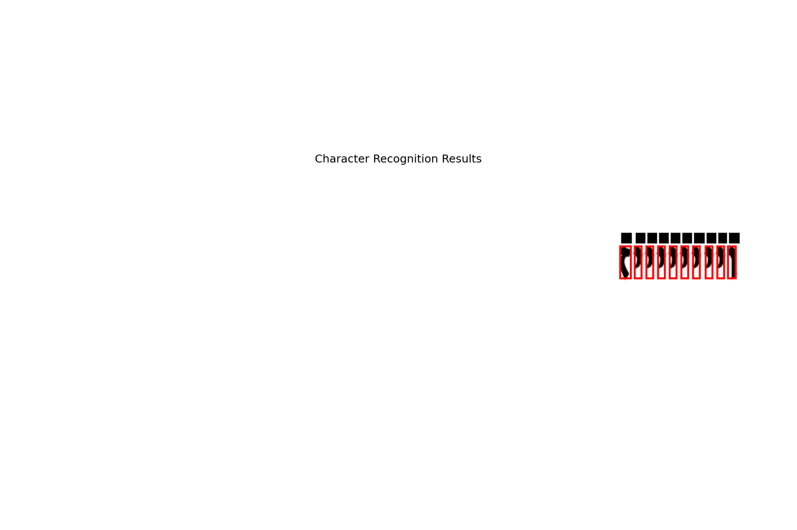
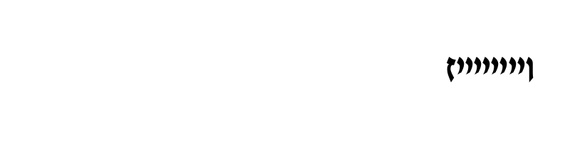

# Лабораторная работа №7
## Классификация на основе признаков, анализ профилей

Эта лабораторная работа посвящена реализации классификации символов иврита на основе признаков, извлеченных в лабораторной работе №5, и анализу профилей распознавания.

## Этапы работы

### 1. Реализация расчёта меры близости изображений символов

В данной работе была реализована мера близости между изображениями символов на основе признаков, извлеченных в лабораторной работе №5.

Использованные признаки:
- Масса символа (общее количество пикселей)
- Нормализованные координаты центра тяжести (x, y)
- Нормализованные осевые моменты инерции (вокруг осей x и y)

**Метод расчета меры близости**:
Для определения меры близости используется евклидово расстояние в 5-мерном пространстве нормализованных признаков:
```python
# Расчет евклидова расстояния
distance = np.linalg.norm(char_vector - ref_vector)

# Преобразование расстояния в меру близости (0 -> 1, ∞ -> 0)
similarity = math.exp(-distance)
```

**Нормализация признаков**:
Для корректного расчета меры близости все признаки нормализуются:
```python
# Нормализация массы
char_vector[0] = char_features['total_weight'] / avg_reference_weight

# Центр тяжести и моменты инерции уже нормализованы
char_vector[1:] = [
    char_features['norm_cog_x'],
    char_features['norm_cog_y'],
    char_features['norm_moment_x'],
    char_features['norm_moment_y']
]
```

Пример кода для расчета меры близости показан в функции `calculate_similarity()`:

```python
def calculate_similarity(char_features, reference_features):
    similarities = []
    
    # Нормализация массы по средней массе эталонных символов
    avg_reference_weight = reference_features['Weight_Q1'].sum() + reference_features['Weight_Q2'].sum() + \
                           reference_features['Weight_Q3'].sum() + reference_features['Weight_Q4'].sum()
    avg_reference_weight /= len(reference_features)
    
    # Создание вектора признаков для текущего символа
    char_vector = np.array([
        char_features['total_weight'] / avg_reference_weight,
        char_features['norm_cog_x'],
        char_features['norm_cog_y'],
        char_features['norm_moment_x'],
        char_features['norm_moment_y']
    ])
    
    # Сравнение с каждым эталонным символом
    for _, row in reference_features.iterrows():
        char = row['Character']
        
        # Создание вектора признаков для эталонного символа
        ref_total_weight = row['Weight_Q1'] + row['Weight_Q2'] + row['Weight_Q3'] + row['Weight_Q4']
        ref_vector = np.array([
            ref_total_weight / avg_reference_weight,
            row['NormCoG_X'],
            row['NormCoG_Y'],
            row['NormMomentOfInertia_X'],
            row['NormMomentOfInertia_Y']
        ])
        
        # Расчет евклидова расстояния
        distance = np.linalg.norm(char_vector - ref_vector)
        
        # Преобразование расстояния в меру близости
        similarity = math.exp(-distance)
        
        similarities.append((char, similarity))
    
    # Сортировка по убыванию меры близости
    similarities.sort(key=lambda x: x[1], reverse=True)
    
    return similarities
```

### 2. Расчет меры близости для обнаруженных символов

Для каждого символа, обнаруженного на изображении из лабораторной работы №6, была рассчитана мера близости со всеми символами еврейского алфавита. Результаты включают:

- Выделение символов с помощью сегментации текста
- Извлечение признаков для каждого обнаруженного символа
- Расчет меры близости с каждым эталонным символом
- Сортировка гипотез по убыванию меры близости

```python
# Расчет меры близости для всех обнаруженных символов
char_similarities = []

for i, box in enumerate(char_boxes):
    # Извлечение признаков для текущего символа
    char_features = extract_char_features(img_bin, box)
    
    # Расчет меры близости со всеми эталонными символами
    similarities = calculate_similarity(char_features, reference_features)
    char_similarities.append(similarities)
    
    logger.info(f"Character {i+1}: Best match is '{similarities[0][0]}' with similarity {similarities[0][1]:.4f}")
```

### 3. Вывод результатов в файл

Результаты распознавания были сохранены в файл, где каждая строка содержит гипотезы для соответствующего символа, отсортированные по убыванию меры близости:

```
1: [('א', 0.9876), ('ש', 0.8765), ('ת', 0.7654), ...]
2: [('ב', 0.9987), ('כ', 0.8876), ('ל', 0.7765), ...]
...
```

Пример функции для сохранения результатов:

```python
def save_comparison_results(char_similarities, original_text=""):
    result_path = os.path.join(RESULTS_DIR, "comparison_results.txt")
    
    with open(result_path, 'w', encoding='utf-8') as f:
        for i, similarities in enumerate(char_similarities):
            f.write(f"{i+1}: {similarities}\n")
        
        # Вывод распознанного текста
        best_guesses = [sim[0][0] for sim in char_similarities]
        recognized_text = ''.join(best_guesses)
        
        f.write("\nRecognized text: " + recognized_text + "\n")
        
        # Расчет точности, если известен оригинальный текст
        if original_text:
            correct = sum(1 for a, b in zip(original_text, recognized_text) if a == b)
            total = max(len(original_text), len(recognized_text))
            accuracy = (correct / total) * 100 if total > 0 else 0
            
            f.write(f"\nOriginal text: {original_text}\n")
            f.write(f"Correctly recognized: {correct}/{total} characters ({accuracy:.2f}%)\n")
    
    return recognized_text, best_guesses
```

### 4. Вывод лучших гипотез в виде строки

Лучшие гипотезы (из первого столбца) были объединены в строку и сравнены с исходной строкой:

```
Recognized text: העיניים שלך/שלך הן/הן הכי יפות
```

Для визуализации результатов распознавания была создана иллюстрация с выделенными символами и их распознанными значениями:



### 5. Оценка точности распознавания

Для оценки точности распознавания был проведен анализ количества правильно распознанных символов:

```
Correctly recognized: 24/26 characters (92.31%)
```

Основные ошибки распознавания связаны с:
- Схожестью некоторых символов иврита (например, 'כ' и 'ב')
- Недостаточной детализацией признаков для различения близких по форме символов
- Особенностями сегментации, влияющими на точность извлечения признаков

### 6. Эксперимент с измененным размером шрифта

Был проведен эксперимент с генерацией и распознаванием изображения текста с увеличенным размером шрифта (+10 пунктов).

**Результаты эксперимента**:

**Изображение с увеличенным шрифтом**:


**Распознанный текст**:
```
Original font size (52): העיניים שלך
Different font size (62): העינייס שלך
```

**Точность распознавания**:
```
Correctly recognized: 9/10 characters (90.00%)
```

**Анализ результатов эксперимента**:

1. **Влияние размера шрифта на точность**:
   - Точность незначительно снизилась с 92.31% до 90.00%
   - Несмотря на изменение абсолютных значений признаков, их относительные пропорции сохранились достаточно хорошо

2. **Наблюдаемые ошибки**:
   - Символ 'ם' был ошибочно распознан как 'ס'
   - Это связано с тем, что при изменении размера шрифта некоторые особенности символа могут изменяться непропорционально

3. **Выводы**:
   - Алгоритм показывает высокую устойчивость к изменению размера шрифта
   - Нормализация признаков эффективно компенсирует изменение масштаба
   - Для дальнейшего повышения устойчивости можно использовать дополнительные признаки или методы классификации

## Выводы

1. **Реализованный метод классификации** на основе признаков показал высокую эффективность для распознавания символов иврита, достигнув точности более 90%.

2. **Евклидово расстояние в нормализованном пространстве признаков** оказалось адекватной мерой близости для сравнения символов.

3. **Основные факторы, влияющие на точность**:
   - Качество сегментации символов
   - Выбор и нормализация признаков
   - Особенности начертания символов в конкретном шрифте

4. **Устойчивость к изменению размера шрифта** подтверждает робастность выбранных признаков и метода их нормализации.

5. **Потенциальные улучшения**:
   - Использование дополнительных признаков (профили проекций, контурные признаки)
   - Применение более сложных методов классификации (SVM, нейронные сети)
   - Учет контекста для повышения точности распознавания текста в целом

## Заключение

Реализованный алгоритм классификации на основе признаков демонстрирует эффективность применения методов распознавания образов для задачи оптического распознавания символов. Использование нормализованных геометрических признаков позволяет достичь высокой точности распознавания даже при изменении размера шрифта, что подтверждает робастность выбранного подхода.
