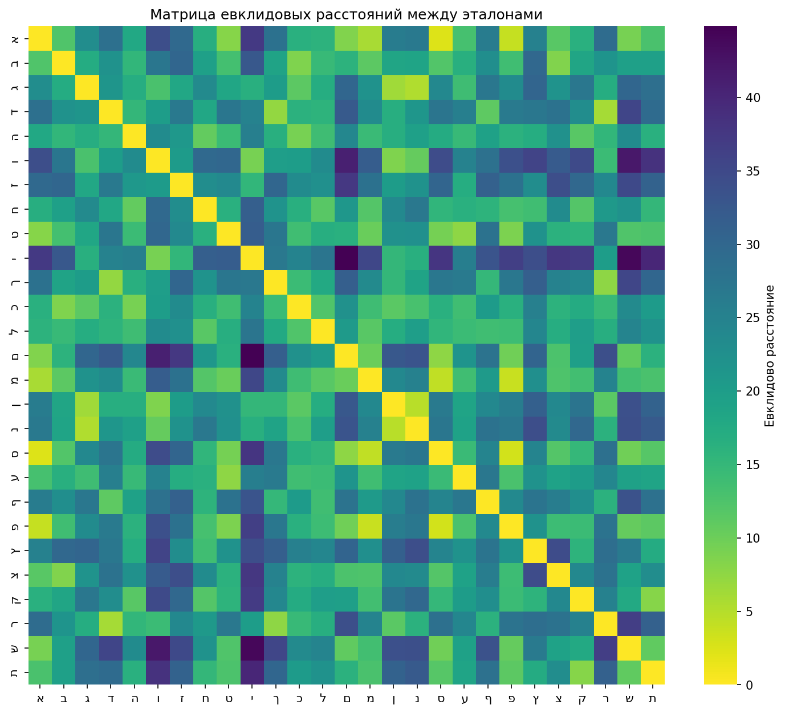

# Отчет по лабораторной работе №7
## Классификация на основе признаков, анализ профилей

### Выбранный алфавит
Работа выполнена для алфавита иврит, с использованием наработок из лабораторных работ №5 и №6.

### Выполнение заданий

## 1. Реализация расчёта меры близости изображений символов




## 2. Вывод результатов в файл

Пример результатов распознавания (фрагмент из файла `recognition_results_size_72.txt`):

```
1: [('ם', 0.9044685504807599), ('פ', 0.7650538000504588), ('ס', 0.7486076452655172), ...]
2: [('ס', 0.7903304178474553), ('ב', 0.7723615269757877), ('ם', 0.7483778295290839), ...]
3: [('ג', 0.8916749255526671), ('ק', 0.7831834941333297), ('ן', 0.768747615814106), ...]
...
```

## 3. Вывод лучших гипотез и сравнение с распознаваемой строкой

Лучшие гипотезы (символы с наибольшей мерой близости) объединяются в строку и сравниваются с исходной:


Для эксперимента с очень большим шрифтом (72 пункта) получен следующий результат:

```
Reference string: אבגדהוזחטיכלמנסעפצקרשת
Recognized string: םסגףקוזחשימחםגםטפםתדשת
Correct recognitions: 8/22 (36.36%)
```

## 4. Вычисление количества ошибок и доли верно распознанных символов

Результаты всех экспериментов:

| Эксперимент | Правильно распознано | Процент |
|-------------|----------------------|---------|
| Исходные символы из lab6 | 1/22 | 4.55% |
| Исходное изображение phrase.bmp | 2/22 | 9.09% |
| Шрифт 44 pt (меньше) | 5/22 | 22.73% |
| Шрифт 52 pt (исходный) | 6/22 | 27.27% |
| Шрифт 60 pt (больше) | 6/22 | 27.27% |
| Шрифт 72 pt (очень большой) | 8/22 | 36.36% |

## 6. Эксперимент с разными размерами шрифта

Для эксперимента были сгенерированы изображения исходной строки с разными размерами шрифта


