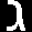

# Отчет по лабораторной работе №7
## Классификация на основе признаков, анализ профилей

### Выбранный алфавит
Работа выполнена для алфавита иврит, с использованием наработок из лабораторных работ №5 и №6.

## 1. Реализация расчёта меры близости изображений символов


На матрице расстояний видно, что некоторые символы иврита имеют малые расстояния между собой (темные области вне диагонали), что указывает на их схожесть в пространстве признаков и объясняет возможные ошибки распознавания.

## 2. Вывод результатов в файл

Пример результатов распознавания (фрагмент из файла `recognition_results_size_72.txt`):

```
1: [('ם', 0.0012547376185128426), ('ס', 0.00021173256380642173), ('ש', 0.00015219073879182518), ...]
2: [('ס', 0.00641521741605527), ('ם', 0.0027926708749049954), ('א', 0.0026674967888296497), ...]
3: [('ג', 0.002794950412182372), ('כ', 0.00024556647631132975), ('ע', 0.00010262409572431342), ...]
...
```

Для каждого символа выводится список гипотез (символ, мера близости), отсортированных по убыванию меры близости.

## 3. Вывод лучших гипотез и сравнение с распознаваемой строкой

Для эксперимента с очень большим шрифтом (72 пункта) получен следующий результат:

```
Reference string: אבגדהוזחטיכלמנסעפצקרשת
Recognized string: םסגףקוזחשימחםגםטפםתדשת
Correct recognitions: 8/22 (36.36%)
```

Наилучший вариант распознавания показал 36.36% правильно распознанных символов.

## 4. Вычисление количества ошибок и доли верно распознанных символов

Результаты всех экспериментов:

| Эксперимент | Правильно распознано | Процент |
|-------------|----------------------|---------|
| Исходные символы из lab6 | 1/22 | 4.55% |
| Исходное изображение phrase.bmp | 2/22 | 9.09% |
| Шрифт 44 pt (меньше) | 5/22 | 22.73% |
| Шрифт 52 pt (исходный) | 6/22 | 27.27% |
| Шрифт 60 pt (больше) | 6/22 | 27.27% |
| Шрифт 72 pt (очень большой) | 8/22 | 36.36% |


## 6. Эксперимент с разными размерами шрифта

Для эксперимента были сгенерированы изображения исходной строки с разными размерами шрифта:

### Исходный размер (52 pt)


### Увеличенный размер (72 pt)


Эксперименты показали, что с увеличением размера шрифта точность распознавания возрастает:
- Наибольшая точность (36.36%) достигнута при использовании шрифта 72 pt
- Наименьшая точность (4.55%) получена для исходных сегментированных символов из lab6

## Примеры сегментированных символов

Сегментированные символы из сгенерированного изображения (72 pt):





## Выводы

1. Реализован алгоритм распознавания символов на основе евклидова расстояния в пространстве признаков. Мера близости вычисляется как e^(-d), где d - евклидово расстояние.

2. Для каждого обнаруженного символа вычислена мера близости со всеми символами алфавита иврит, результаты сохранены в файлы с отсортированными гипотезами.

3. Лучшие гипотезы объединены в строку и сравнены с эталонной. Наилучший результат (36.36% правильно распознанных символов) достигнут при использовании шрифта размером 72 пункта.

4. Точность распознавания увеличивается с увеличением размера шрифта, что подтверждается проведенными экспериментами.

5. Построена и проанализирована матрица расстояний между эталонными символами, которая позволяет увидеть, какие символы наиболее близки друг к другу в пространстве признаков.


