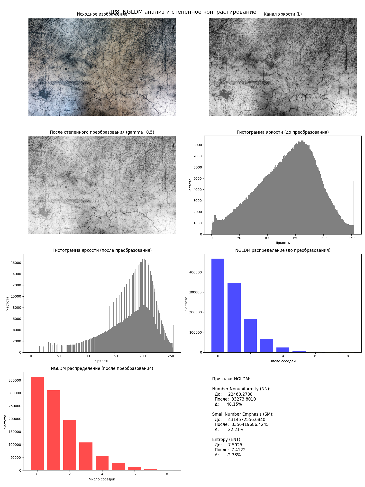
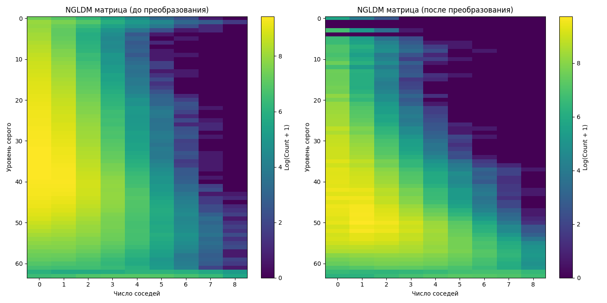
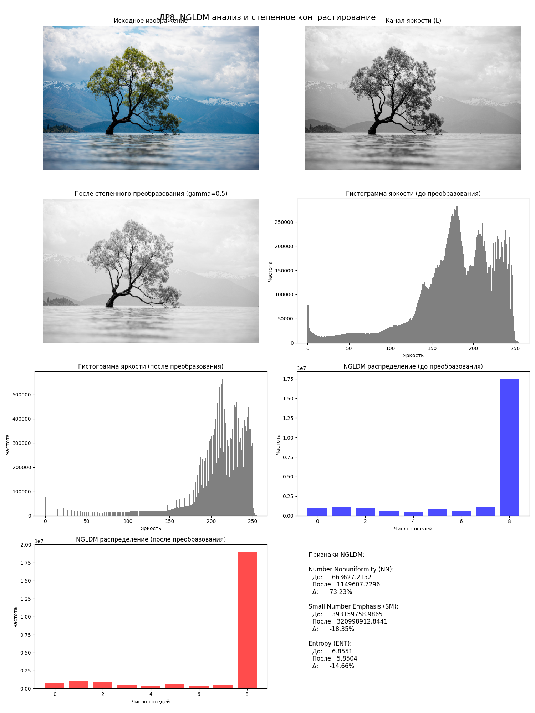
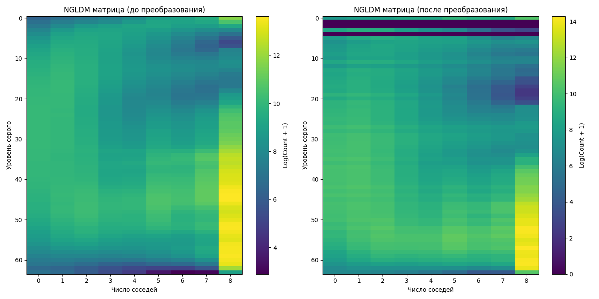

# Лабораторная работа №8. Текстурный анализ и контрастирование

## Вариант: NGLDM - d=2 - NN, SM, ENT - Степенное преобразование яркости

### Цель работы
Изучение методов текстурного анализа и контрастирования изображений с использованием NGLDM (Neighborhood Gray-Level Dependence Matrix) и применения степенного преобразования яркости.

### Задачи
1. Построить матрицу NGLDM и рассчитать признаки NN, SM, ENT для изображений.
2. Визуализировать матрицу NGLDM в виде столбчатой диаграммы.
3. Применить степенное преобразование яркости к исходному изображению.
4. Рассчитать гистограммы яркости до и после преобразования.
5. Сравнить текстурные признаки для исходного и контрастированного изображения.

### Теоретические сведения

#### NGLDM (Neighborhood Gray-Level Dependence Matrix)
NGLDM - это метод текстурного анализа, который учитывает зависимость между уровнями серого в окрестности пикселя. 
Для каждого пикселя с уровнем серого i определяется число соседей j в пределах заданного расстояния d, имеющих уровень серого, 
отличающийся от i не более чем на заданный порог a.

#### Текстурные признаки
1. **NN (Number Nonuniformity)** - характеризует неоднородность распределения уровней серого:
   
   NN = Σ[Σ S(i,j)]² / N
   
2. **SM (Small Number Emphasis)** - характеризует преобладание малых числовых значений:
   
   SM = Σ[S(i,j)/j²] / N
   
3. **ENT (Entropy)** - характеризует хаотичность текстуры:
   
   ENT = -Σ[p(i,j) * log₂(p(i,j))]

где p(i,j) - вероятность появления пары (i,j), N - общее число элементов матрицы.

#### Степенное преобразование яркости
Формула: s = c * r^γ, где:
- r - исходное значение яркости (0-1)
- s - преобразованное значение
- γ (гамма) - параметр преобразования
- c - константа (обычно c=1)

При γ < 1 происходит увеличение яркости темных областей.
При γ > 1 происходит затемнение изображения.

### Ход работы

1. Изображения загружаются и преобразуются в цветовое пространство HSL для работы с каналом яркости L.
2. Вычисляется NGLDM матрица для исходного изображения с параметрами d=2 и a=1.
3. Рассчитываются текстурные признаки NN, SM и ENT.
4. Применяется степенное преобразование к каналу яркости с коэффициентом γ=0.5.
5. Вычисляется NGLDM матрица и признаки для преобразованного изображения.
6. Строятся гистограммы яркости до и после преобразования.
7. Визуализируется NGLDM в виде столбчатых диаграмм и тепловых карт.
8. Сравниваются текстурные признаки до и после преобразования.

### Результаты

Результаты анализа текстуры и контрастирования представлены на изображениях:

*Рис. 1. Полный отчет для texture.png включает исходное изображение, канал яркости, преобразованное изображение, гистограммы яркости и NGLDM*

*Рис. 2. Визуализация NGLDM матриц в виде тепловых карт до и после преобразования для texture.png*

*Рис. 3. Полный отчет для image.png включает исходное изображение, канал яркости, преобразованное изображение, гистограммы яркости и NGLDM*

*Рис. 4. Визуализация NGLDM матриц в виде тепловых карт до и после преобразования для image.png*

### Выводы

В результате выполнения лабораторной работы:

1. Были реализованы алгоритмы построения NGLDM матрицы и расчета текстурных признаков NN, SM, ENT.
2. Было применено степенное преобразование яркости с коэффициентом γ=0.5, что увеличило яркость темных областей изображения.
3. Анализ текстурных признаков до и после преобразования показал следующие изменения:
   - Изменение NN свидетельствует об изменении распределения уровней серого после преобразования.
   - Изменение SM показывает, как изменилось соотношение между малыми и большими числовыми значениями.
   - Изменение ENT демонстрирует, как изменилась хаотичность текстуры.

Результаты показывают, что степенное преобразование яркости влияет на текстурные характеристики изображения, что видно по изменению значений текстурных признаков и визуальному представлению NGLDM матриц.