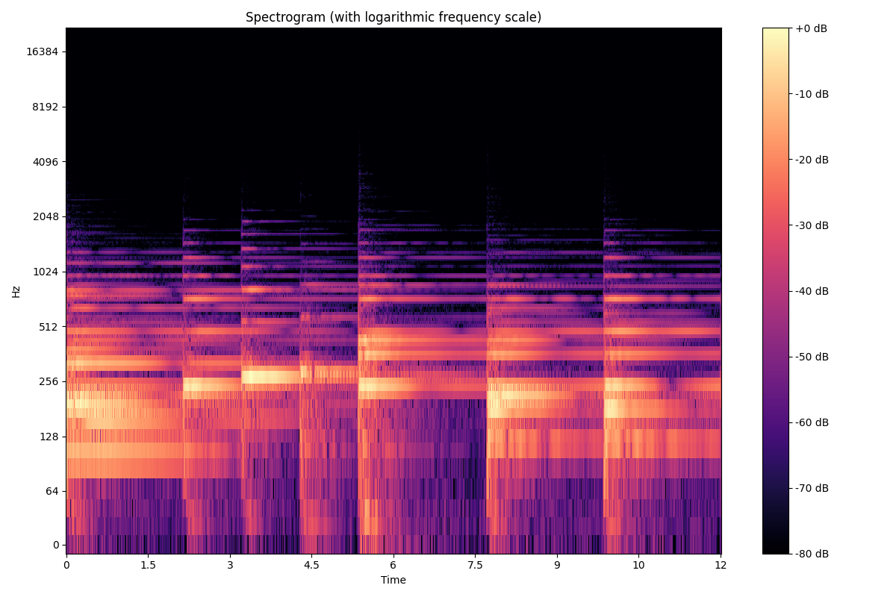
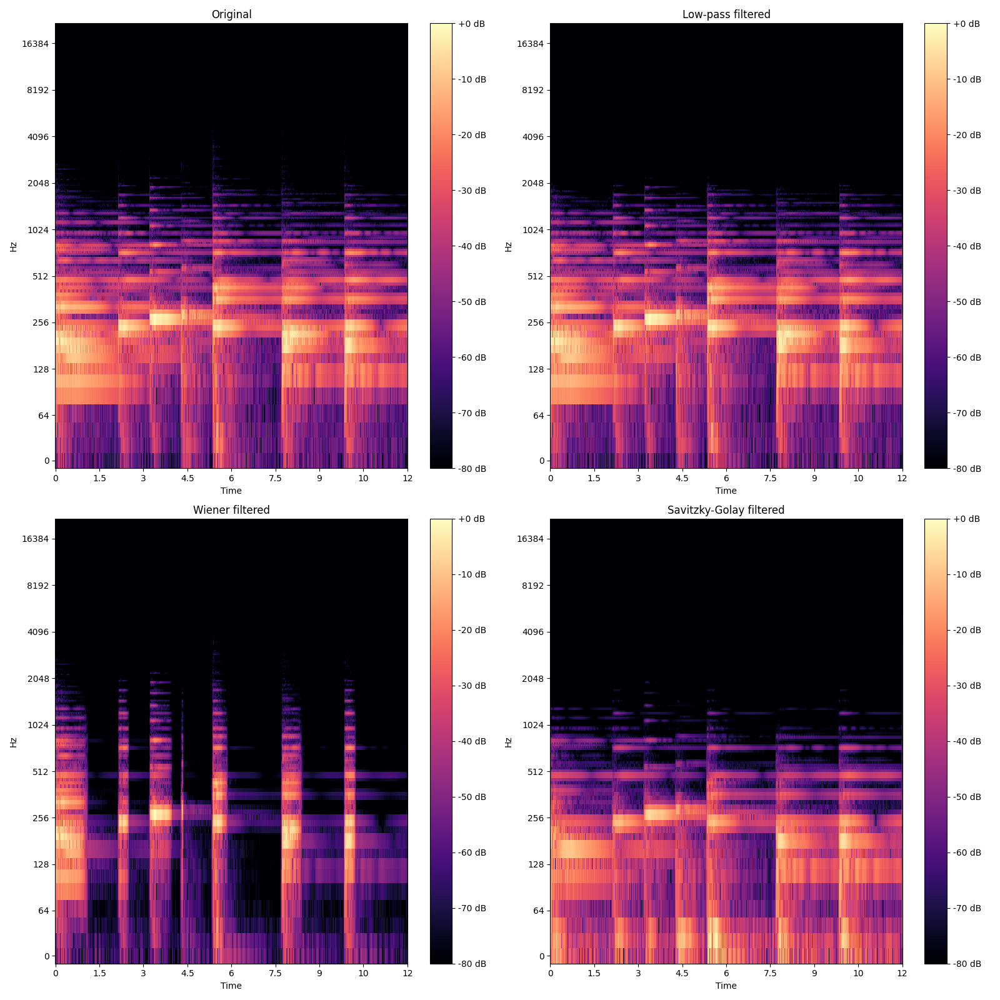
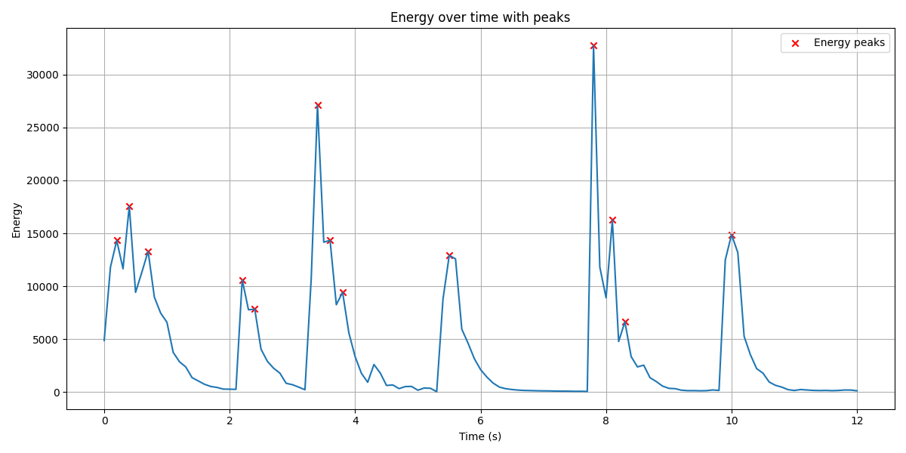

# Лабораторная работа №9. Анализ шума

### Пункт 1. Мелодия

Характеристики аудиофайла:
- Длительность: 12.01 секунд
- Частота дискретизации (sample rate): 44100 Гц
- Количество отсчетов: 529856

### Пункт 2. Построение спектрограммы

Для построения спектрограммы было использовано оконное преобразование Фурье (STFT) с окном Ханна. Размер окна был выбран 2048 отсчетов. Шаг между окнами (hop_length) составил 512 отсчетов.

### Пункт 3. Оценка уровня шума и шумоподавление

Для оценки уровня шума и его удаления были применены три различных метода:

1. **Фильтр низких частот (Low-pass filter)**

2. **Фильтр Винера (Wiener filter)**

3. **Фильтр Савицкого-Голея (Savitzky-Golay filter)**

**Результаты оценки уровня шума:**
- Стандартное отклонение оригинального сигнала: 0.070142
- Шум, удаленный фильтром низких частот: 0.000096
- Шум, удаленный фильтром Винера: 0.038247
- Шум, удаленный фильтром Савицкого-Голея: 0.070388

Сравнение спектрограмм до и после шумоподавления:
1. Оригинальный сигнал
2. Сигнал после фильтра низких частот
3. Сигнал после фильтра Винера
4. Сигнал после фильтра Савицкого-Голея

### Пункт 4. Поиск моментов времени с наибольшей энергией

**Все найденные пики энергии (всего 13):**
| № | Время (с) | Энергия |
|---|-----------|---------|
| 1 | 7.80 | 32738.89 |
| 2 | 3.40 | 27088.86 |
| 3 | 0.40 | 17561.81 |
| 4 | 8.10 | 16255.86 |
| 5 | 10.00 | 14882.63 |
| 6 | 3.60 | 14338.75 |
| 7 | 0.20 | 14323.66 |
| 8 | 0.70 | 13303.53 |
| 9 | 5.50 | 12914.78 |
| 10 | 2.20 | 10608.75 |
| 11 | 3.80 | 9427.31 |
| 12 | 2.40 | 7841.17 |
| 13 | 8.30 | 6638.61 |
